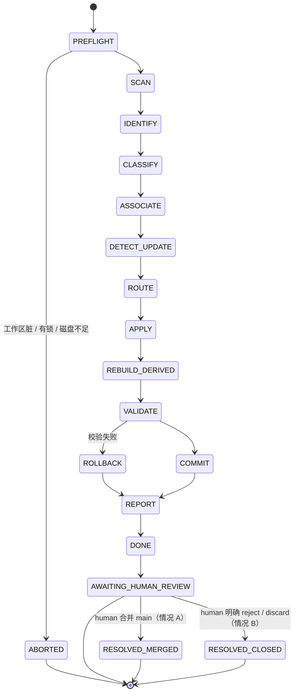

# V2_ARCHITECTURE_PROPOSAL — 长期个人技术知识库架构提案

> **状态：待审批的设计文档。本轮不实现、不迁移、不移动任何现有文件。**
>
> 依据：[`V1_INVENTORY.md`](./V1_INVENTORY.md)（Phase 0 实测审计）。本文中所有「V1 已有」「V1 缺失」的断言均可在该文件中找到实测证据。
>
> 配套：[`V1_TO_V2_MAPPING.md`](./V1_TO_V2_MAPPING.md)、[`MIGRATION_PLAN_V2.md`](./MIGRATION_PLAN_V2.md)。

---

## 0. 阅读顺序

| 想知道什么 | 看哪一节 |
|---|---|
| V2 到底要变成什么 | §1、§2 |
| 我的知识会被怎么组织 | §3、§4、§5 |
| Agent 会不会改坏我的东西 | §8、§15、§17、§19 |
| 每天怎么用 | §11、§16 |
| front matter 要不要拆 | §6.4（专项论证） |
| 第一步做什么 | §20 |
| 有什么可能出错 | §22 |

---

## 1. V2 定位

### 1.1 从「研究实验室」到「知识策展基础设施」

| | V1 | V2 |
|---|---|---|
| 自我定位 | 具身智能研究实验室 | 长期个人技术知识库（Personal Technical Knowledge Base） |
| 领域数 | 1（具身智能） | N（具身智能为深度主干 + 若干广度分支） |
| 组织主轴 | 文档类型（foundations / topics / papers / …） | 领域（domain）→ 类型降级为元数据 |
| 知识进入方式 | 人工判断 + 人工放置 | inbox → 自动分诊 → 人工兜底 |
| 索引 | 手写、必然漂移（已漂移，见 V1_INVENTORY §4.4） | 派生、可重建、可校验 |
| 文档身份 | 文件路径 | 稳定 uid |
| 版本史 | 事实上不存在（2 次提交，见 V1_INVENTORY §2.3） | Git 分支 + 分类提交粒度 |
| Agent 角色 | 助手（不 commit） | 角色化：默认助手 + 夜间策展员 + 一次性迁移工 |

### 1.2 T 型结构的落地形态

```text
广度：  machine-learning  computer-systems  mathematics  research-methodology  agent-engineering  …
        ─────────────────────────────────────────────────────────────────────────────────────
深度：                        embodied-ai / robotics
                                     │
                    concepts · topics · literature · experiments · ideas · reports
```

- **深度轴**由 `embodied-ai` 域独占：它保留 V1 的六类语义分层，并继续接收最密集的维护；
- **广度轴**上的新域，**默认只开 `notes/` 一层**，不预先复制六层结构。层级在真实需要时才长出来。
- 这条规则写死为设计原则：**结构跟随内容，不预置空壳**。

### 1.3 不变量（V2 的宪法）

任何后续设计与实现都不得违反：

1. **用户原始材料永不被 Agent 删除或改写。**
2. **用户观点永不被 Agent 自动改写。**（识别方式见 §8.4）
3. **来源、时间、关系、不确定性四项元信息，宁可留空，不可编造。**
4. **任何 Agent 写入都必须可审计、可回滚。**
5. **派生数据可以随时全部删除并重建；不可重建的一律不是派生数据。**
6. **无法判断时，进入 `review/`，不猜。**

---

## 2. 领域模型（Domain Model）

### 2.1 一级领域

| domain id | 中文名 | 定位 | 初始深度 |
|---|---|---|---|
| `embodied-ai` | 具身智能与机器人学习 | **主干**，承接 V1 全部内容 | 六层完整 |
| `machine-learning` | 机器学习与深度学习 | 广度 | 单层 |
| `computer-systems` | 计算机系统（OS / 网络 / 编译 / 分布式） | 广度 | 单层 |
| `mathematics` | 数学基础 | 广度 | 单层 |
| `research-methodology` | 研究方法论 | 广度 | 单层 |
| `agent-engineering` | Agent 与知识工程 | 广度（本仓库自身的元领域） | 单层 |

### 2.2 领域是受控的，且只能由用户新增

- 领域清单存放于 `schema/domains.yaml`；
- **Agent 不得新增、重命名或删除领域**（FORBIDDEN，见 §15）；
- 无法归入现有领域的内容 → `review/ambiguous/`，由用户决定是「归入现有领域」还是「开新领域」。

理由：V1 的 tags 在 6 天内从 14 漂到 39（V1_INVENTORY §3.3）。领域是知识库的最高层骨架，一旦允许自动扩张，两周后就会出现 `vla`、`robotics`、`embodied` 三个同义领域。

### 2.3 领域内的第二层：语义角色（role）

保留 V1 六类语义，但重命名为**生命周期角色**，并明确它们不是目录约束而是对象类型：

| V2 role | V1 来源 | 本质问题 | 典型变化频率 |
|---|---|---|---|
| `concept` | `01_foundations` | 这个东西是什么？ | 缓慢、累积 |
| `topic` | `02_topics` | 这条技术路线怎么演进的？ | 中速、重写 |
| `literature` | `03_papers` | 这篇材料说了什么？ | 一次成型 + 版本更新 |
| `experiment` | `04_experiments` | 我实际跑出来什么？ | 追加为主 |
| `idea` | `05_ideas` | 我猜测什么？还没验证。 | 频繁、可能被证伪 |
| `report` | `06_reports` | 某个时点我对外说了什么？ | **冻结** |

新增两个 V1 隐含但无处安放的角色：

| V2 role | 为什么必须新增 | V1 证据 |
|---|---|---|
| `log` | `READING_LOG.md` 是 append-only 的时间流，混在 topic 里 | V1_INVENTORY §5 / I7 |
| `question` | `RESEARCH_MAP §4` 的五个开放问题是真正的知识节点，却寄生在地图文件里 | V1_INVENTORY §6 / D8 |

---

## 3. 知识对象模型（Knowledge Object Model）

### 3.1 对象总表

每个知识对象 = **一个 canonical Markdown 文件 + 可选 sidecar 元数据**。

| type | role | 是否 living | 是否可被 Agent 改正文 | 版本语义 |
|---|---|---|---|---|
| `note.concept` | concept | **是** | 否（仅可追加「待整理」区块） | 累积 |
| `note.literature` | literature | 弱 | 否 | 随 source version 更新 |
| `synthesis.topic` | topic | **是** | 否 | 重写式演进 |
| `record.experiment` | experiment | 追加 | 否 | append-only |
| `hypothesis.idea` | idea | **是** | 否 | 可被证伪→ `superseded` |
| `hypothesis.question` | question | **是** | 否 | 可被回答→ `historical` |
| `plan.learning` | concept 配套 | **是** | 是（仅进度字段行） | 状态机 |
| `log.reading` / `log.work` | log | append-only | 是（仅追加） | 追加 |
| `report.snapshot` | report | **否（冻结）** | **否，且不可修改** | 不可变 |
| `map.moc` | 导航 | 是 | 半（仅「自动补充」区块） | 人工主导 |
| `index.*` | 导航 | — | **是（完全派生）** | 每次重建 |
| `source.record` | 来源 | 半 | 是（仅核验字段） | 追加版本 |

### 3.2 「簇」（cluster）作为一等概念

V1 的实际组织粒度既不是单文档也不是目录层，而是**知识簇**（V1_INVENTORY §5 / I7）：

- `ript_vla/` = 1 篇论文 + 3 篇同源深入拆解；
- `lingbot/` = 1 个模型家族 7 篇；
- `d6_failure_detection/` = 1 个质量维度 9 篇；
- `reinforcement_learning/` = 1 个学习主题的规划 + 笔记双文档。

V2 显式承认它：

```yaml
cluster: embodied-ai/ript-vla     # 可选；同簇文档共享一个 cluster id
cluster_role: primary | companion | index
```

作用：
1. **重复检测**必须以簇为单位——同簇的 4 个文档不是重复，跨簇的同名文档才可疑；
2. 派生索引按簇折叠，避免 9 篇 D6 淹没导航；
3. 迁移以簇为最小事务单元（一次移动一个簇，不拆散）。

---

## 4. 仓库布局（Repository Layout）

### 4.1 目标形态（V2 完全体）

```text
my-embodied-ai-kb/
├── README.md                     ← HOME：唯一人类入口
├── AGENTS.md                     ← v2：角色化权限
├── CHANGELOG.md
│
├── schema/                       ← 受控词表与校验规则（唯一真源）
│   ├── domains.yaml
│   ├── object-types.yaml
│   ├── relations.yaml
│   ├── metadata.schema.yaml
│   └── intake-rules.yaml         ← 继承 MIGRATION_CHECKLIST §1 排除规则
│
├── inbox/                        ← 白天丢东西的地方
│   └── README.md
├── review/                       ← Agent 无法确定 → 人工裁决
│   ├── ambiguous/
│   ├── conflicts/
│   ├── duplicates/
│   └── README.md
│
├── kb/                           ← ★ KNOWLEDGE 平面（canonical）
│   ├── embodied-ai/
│   │   ├── _domain.md
│   │   ├── concepts/  topics/  literature/  experiments/  ideas/  reports/
│   ├── machine-learning/
│   ├── computer-systems/
│   ├── mathematics/
│   ├── research-methodology/
│   └── agent-engineering/
│
├── sources/                      ← ★ SOURCE 平面
│   ├── registry/                 ← 每个来源一个 yaml（小、必入 git）
│   │   └── arxiv-2505.17016.yaml
│   └── files/                    ← 字节本体（LFS 或 gitignore，按策略）
│
├── maps/                         ← 人工策展的 MOC（**不是派生**）
│   └── embodied-ai.md
│
├── derived/                      ← ★ DERIVED 平面（可整目录删除并重建，deterministic）
│   ├── indexes/                  by-domain / by-type / by-status / by-tag / by-title / uid-map.json
│   ├── timeline.md               recent.md      learning-status.md
│   ├── graph/                    graph.json  graph.mermaid
│   └── health/                   links.md  schema.md  orphans.md  stale.md  duplicates.md

├── reports/                      ← ★ OPERATIONAL HISTORY 平面（nightly 运行记录，非 Derived）
│   └── nightly/
│       └── YYYY-MM-DD/<run-id>.md   每次 nightly 的运行报告（按 run-id 唯一命名，避免同一天多次 attempt 冲突）
│
├── .curator/                     ← 运行时状态（runtime state；**非知识 / 非 Derived / 非 Operational History**）
│   └── runs/
│       └── <run-id>/             run-state.json / report.md / attempted-plan.json / validation-errors.json / affected-items.json
│                                （gitignore；即使 nightly 分支被 reset / 删除，运行失败现场也保留于此）
│
├── templates/                    ← 按 object type 的模板（V1 七件套升级）
├── tools/                        ← 校验与策展脚本（Phase 2+）
│
└── docs/                         ← ★ V1 原结构，本阶段完全不动
    └── 01_foundations … 06_reports
```

> 四平面总览：Source（`sources/`）/ Knowledge（`kb/` + `docs/`）为知识平面，内容不可重建；Derived（`derived/`）为确定性派生，可整目录删除重建；Operational History（`reports/`）为 nightly 运行记录，含易变运行信息，独立于 Derived。

### 4.2 共存规则（本阶段最关键的一条）

```text
docs/    = V1 知识，冻结位置，只做「链接修复 + uid 注入」两类零风险改动
kb/      = V2 知识，所有新内容一律进这里
```

- **不允许**在 M6 之前移动 `docs/` 下任何文件；
- 两侧同时被 `derived/indexes/` 覆盖，用户永远只需要看一个索引；
- `docs/` 下的文档一旦被真实使用（引用、更新、扩写），才触发迁移到 `kb/`——继承 V1「使用时迁移」原则。

### 4.3 为什么 `maps/` 不在 `derived/`

`maps/embodied-ai.md` 是**用户的认知结构**，不是数据聚合。它包含「我认为这几条主线之间是这样连接的」这种判断，无法从元数据推导。

折中：MOC 文件中允许有一个 **`<!-- AUTO:BEGIN -->` … `<!-- AUTO:END -->`** 区块，Agent 只能改这个区块（例如「本域最近新增的 5 个节点」），区块外一律人工。

---

## 5. Source / Knowledge / Derived 分离

### 5.1 判定测试

> **删掉它会不会丢信息？**
> 会 → Source 或 Knowledge。不会 → Derived。

| 平面 | 内容 | 谁写 | 删了会怎样 | Git 策略 |
|---|---|---|---|---|
| **Source** | 论文 PDF、PPTX、原始 docx、代码快照、网页存档、用户原始未加工资料 | 用户（Agent 只登记） | **不可恢复** | registry 入 git；files 按大小走 LFS 或外部保存 |
| **Knowledge** | 阅读笔记、概念笔记、专题综合、实验结论、想法、报告 | **仅用户**（Agent 受限） | **不可恢复** | 全部入 git，逐文档历史 |
| **Derived** | 索引、时间线、recent、图谱、健康报告、部分 map 区块 | **仅 Agent** | 一条命令重建 | 入 git（便于 GitHub 浏览），但标记 generated |
| **Operational History** | nightly 运行报告（`reports/nightly/YYYY-MM-DD/<run-id>.md`，可入 git）、**运行时审计**（`.curator/runs/<run-id>/`，gitignore，非知识） | **仅 Agent** | 运行产生；可保留但**不可重建为「同一份」**（含时间戳 / run id）。运行时审计即使 nightly 分支被 reset / 删除也不消失 | 运行报告入 git（不标记 generated、不参与派生确定性校验）；`.curator/runs/` 属运行时状态，可 gitignore |

> 四平面中，Source / Knowledge / Derived 是「知识平面」；Operational History 是「系统运行记录平面」，与知识内容正交。Nightly Report 之所以**不放在 `derived/`**，正是因为它含有运行时间、run id 等易变信息，一旦进 Derived 就会破坏派生确定性（见 P0-5 / §12.1）。

### 5.2 Source registry 的形态

解决 V1_INVENTORY §4.3 的机器绑定绝对路径问题：

```yaml
# sources/registry/arxiv-2505.17016.yaml
source_id: arxiv-2505.17016
kind: paper
title: "RIPT-VLA: Interactive Post-Training for Vision-Language-Action Models"
canonical_url: https://arxiv.org/abs/2505.17016
versions:
  - version: v1
    published_at: 2025-05-22
    retrieved_at: 2026-07-31
latest_version: v1
license: unknown           # V1 已核验：官方仓库 license=null
code_url: https://github.com/Ariostgx/ript-vla
project_url: https://ariostgx.github.io/ript_vla/
project_url_status: 404    # 2026-07-31 核验
last_verified_at: 2026-07-31
storage:
  in_repo: docs/03_papers/ript_vla/RIPT-VLA_2505.17016v1.pdf   # LFS
  local_hint: null
referenced_by: [k-7Q2M4XNAB1TE]     # 派生，可重建
```

对于**不入库的大 PDF**（V1 的 15 处 `pdf_index`）：

```yaml
storage:
  in_repo: null
  local_hint: "D:/materials/VLA/openvla/2406.09246v3.pdf"   # 原样保留，标记为机器本地提示
  portable: false
```

**关键点**：绝对路径不删（那是用户的真实信息），但被降级为 `local_hint` 并显式标记 `portable: false`，同时 `canonical_url` 成为可移植的第一引用。健康检查会统计 `portable: false` 的比例。

### 5.3 Derived 的自我声明

每个派生文件顶部：

```markdown
<!-- GENERATED FILE — DO NOT EDIT
     generator: tools/build_indexes.py
     inputs_hash: sha256:9f2c…
     rebuild: python tools/build_indexes.py
-->
```

- 头信息只允许放**稳定的非易变元数据**（generator 名、inputs_hash、rebuild 命令）。**运行时间、`run_id`、随机值等易变字段一律不得写入派生内容**——派生内容必须是「输入的确定性纯函数」（见 §12.1）。
- 运行信息（本次 run id、触发时间、耗时）记录在 nightly **run report** 中（见 §16.4，位于 `reports/nightly/`，属 operational history，非 Derived）。
- 若用户手改了派生文件，下次运行检测到 `inputs_hash` 与内容不匹配 → **把用户的改动搬到 `review/conflicts/`，不静默覆盖**。

---

## 6. 元数据模型（Metadata Model）

### 6.1 字段分层

**A. 通用必填（8 个，所有知识对象）**

| 字段 | 类型 | 谁写 | 说明 |
|---|---|---|---|
| `uid` | string | Agent 生成一次 | 永不变，见 §7 |
| `title` | string | 用户 | |
| `type` | enum | 用户 | 来自 `schema/object-types.yaml` |
| `domain` | enum | 用户 | 来自 `schema/domains.yaml` |
| `document_state` | enum | 用户 | 文档对象生命周期，见 §6.3 |
| `knowledge_status` | enum | 用户 | 认识论状态，见 §6.3 |
| `created` | date | 用户/Agent | V1 兼容字段名 |
| `updated` | date | Agent（仅正文变更时） | V1 兼容字段名 |

**B. 通用可选**

`aliases[]`、`tags[]`、`primary_topic`、`cluster` / `cluster_role`、`relations[]`、`sources[]`、`temporal_class`、`confidence`

**C. Agent 记账（进 sidecar，见 §6.4）**

`ingested_at`、`reviewed_at`、`last_verified_at`、`content_hash`、`canonical_path`、`previous_paths[]`、`identity_key`

> `link_health` 与 `nightly_runs[]` **不进 sidecar**：前者属 `derived/health/`（派生健康指标，可重建，不持久化，见 P1-1）；后者属 operational history（见 `reports/nightly/`，见 §16 / P0-6）。每个字段只允许出现在一个地方（§6.4 总原则）。

**D. 类型扩展**

| type | 扩展字段 |
|---|---|
| `note.literature` | `source_id`、`source_version_read`、`published_at`、`venue`、`authors`、`read_status`、`read_level`、`primary_dimension` |
| `record.experiment` | `code_repo`、`code_commit`、`env`、`dataset_version`、`result_status`、`reproduced_by` |
| `hypothesis.idea` / `question` | `confidence`、`falsifier`、`minimal_experiment`、`resolved_by` |
| `plan.learning` | `stages[]`、`current_stage`、`progress` |
| `report.snapshot` | `audience`、`frozen_at`、`supersedes` |

> D 类字段的依据：V1 的 `d6_failure_detection/` 9 篇笔记已经自发使用了 22 字段 schema（V1_INVENTORY §3.2）。V2 不是新增负担，而是把已经发生的事情标准化。

### 6.2 `temporal_class` → 复验 SLA

| temporal_class | 含义 | 复验周期 | 例子 |
|---|---|---:|---|
| `stable` | 数学与理论，几乎不过期 | 365 天 | MDP 定义、GAE 推导 |
| `evolving` | 方法路线，年度级演进 | 180 天 | VLA 后训练路线比较 |
| `fast_moving` | SOTA 数字、preprint、开源状态 | 60 天 | arXiv 2026 预印本、仓库 license 状态 |

**确定性健康指标（重点）**：为避免「同一仓库状态、不同日期产生不同派生输出」而破坏派生确定性（§12.1），健康计算**不依赖隐式系统时间**。改用：

```text
verification_due_at = last_verified_at + SLA(temporal_class)   # 确定性：纯显式输入
```

- `SLA` 由 `temporal_class` 决定（见上表：`stable`=365 / `evolving`=180 / `fast_moving`=60 天）；
- 提交的 `derived/health/stale.md` **只记录 `verification_due_at` 与 `stale / not-stale` 判定**（确定性、可重建），**不再每天产出 `debt_days + 1` 的滚动数字**，避免无意义 diff 噪声；
- 若健康报告确需展示「逾期天数（`overdue_days`）」，则 `as_of_date` 必须作为 Derived Builder 的**显式输入**传入，并参与 `inputs_hash`——**禁止脚本隐式调用系统当前时间却声称「相同输入产生相同结果」**。

**这是把 V1 的被动「核验日期」变成主动机制的关键一步**，也是 V2 对研究型知识库最实际的增值；同时严守「所有影响 committed Derived 输出的变量都必须是显式输入」。

### 6.3 `document_state` 与 `knowledge_status`（两个正交轴）

V1 的单一 `status` 把「文档工作流状态」与「知识认识论状态」混在一起，导致两者都无法被清晰使用（V1_INVENTORY D9：后两态从未被使用）。V2 显式拆成两个**正交**维度：

**轴一：`document_state` — 文档对象生命周期（workflow state）**

| 值 | 含义 | 谁可设置 |
|---|---|---|
| `draft` | 初稿，尚未进入正式知识流 | 用户 / Agent 可新建为 draft |
| `active` | 正在维护、可被发现与引用 | 用户 |
| `stable` | 内容已成熟，变更需谨慎 | 用户 |
| `frozen` | 冻结为不可变快照（如 `report.snapshot`） | 用户 |
| `archived` | 保留但不再主动维护 / 不出现在主索引 | 用户 |

**轴二：`knowledge_status` — 认识论状态（epistemological state）**

| 值 | 含义 | 谁可设置 |
|---|---|---|
| `unverified` | 已写下，来源/结论尚未核验 | 用户 / Agent |
| `current` | 当前有效结论 | 用户 |
| `disputed` | 存在冲突证据，未裁决 | 用户 / Agent 可**提议** |
| `superseded` | 被更新结论取代（需 `superseded_by: <uid>`） | **仅用户** |
| `historical` | 保留作为历史记录，不再作为当前判断 | **仅用户** |

- 两轴**相互独立**：一篇 `active` 的文档可以同时是 `unverified`（刚写完还没核验）或 `current`（已确认有效）；一篇 `stable` 的文档可以是 `disputed`（结论被新证据挑战）。
- V1 的 `seed` → `knowledge_status: unverified`；**V1 的 `active` 默认也映射到 `unverified`**，**不自动推断为 `current`**（活跃维护 ≠ 知识已被确认有效，见 `V1_TO_V2_MAPPING.md` §5.4 的保守迁移铁律 R2-7）。V1 的 `stable` / `archived` **不再废弃**——它们本就属于生命周期轴，只是 V1 把它错放在 `status` 里，本轮（v2-rev1）将其归入 `document_state`（映射表见 `V1_TO_V2_MAPPING.md` §5.4）。

### 6.4 ★ 专项论证：front matter vs sidecar

这是 V2 最容易做错的决策，因此单独论证。

#### 三个方案

| | A. 纯 front matter（V1 现状） | B. 纯 sidecar | C. 按写入者拆分（推荐） |
|---|---|---|---|
| 人类正文与 Agent 元数据 diff 解耦 | ✗ 每晚记账都污染知识文件 | ✓ | ✓ 高频记账进 sidecar |
| living document 更新噪声 | ✗ 严重 | ✓ | ✓ |
| Git review 可读性 | ✗ 一个 diff 里混两类改动 | ✓ | ✓ 且可用提交分层进一步强化（§17） |
| Obsidian 兼容 | ✓ 原生 | ✗ 完全看不到 tags/type | ✓ 关键字段仍在 front matter |
| 元数据查询 | ✓ 需解析 md | ✓ 最方便 | ○ 需合并两处 |
| 迁移成本 | 0 | **高**：63 个文件全部改写，直接违反「不重写现有正文」 | **≈0**：sidecar 是纯增量 |
| 文件重命名/移动后的失联风险 | ✓ 不可能失联 | ✗ sidecar 易成孤儿 | ✓ `uid` 在 front matter，sidecar 永远可重建 |
| 用户手工修正元数据 | ✓ 就在眼前 | ✗ 要开第二个文件 | ✓ 用户关心的都在 front matter |
| 文件数量 | 74 | 148 | ≤148（只有被处理过的文档才有 sidecar） |

#### 最终建议：方案 C，按**写入者**而非按**内容**拆分

规则一句话：

> **用户会读、会改、Obsidian 要用的字段 → front matter。
> Agent 每次运行都要重写的记账字段 → sidecar。
> 每个字段只允许出现在一个地方。**

```yaml
# kb/embodied-ai/literature/ript-vla.md  （front matter：用户域）
---
uid: k-7Q2M4XNAB1TE
title: "RIPT-VLA 阅读笔记"
type: note.literature
domain: embodied-ai
document_state: active
knowledge_status: current
temporal_class: evolving
cluster: embodied-ai/ript-vla
cluster_role: primary
created: 2026-07-31
updated: 2026-08-03
tags: [vla, reinforcement-learning, post-training]
sources: [arxiv-2505.17016]
relations:
  - {type: extends, target: k-3H8P1KMWQ7ZX}
  - {type: contrasts_with, target: k-9B4T6VNCLD2Y}
---
```

```yaml
# kb/embodied-ai/literature/ript-vla.meta.yaml   （sidecar：仅 durable 记账，Agent 域）
uid: k-7Q2M4XNAB1TE
identity_key: "embodied-ai::literature::ript-vla"
canonical_path: kb/embodied-ai/literature/ript-vla.md
previous_paths:
  - docs/03_papers/ript_vla/RIPT-VLA_阅读笔记.md
content_hash: sha256:4d1a…
ingested_at: 2026-07-31T00:00:00Z
reviewed_at: 2026-08-03T00:00:00Z
last_verified_at: 2026-07-31
# 注意：verification_due_at / stale 标记 属 derived/health/（确定性派生，不依赖隐式系统时间，可重建）
#       link_health 属 derived/health/；nightly_runs 属 operational history（reports/nightly/），均不写进 sidecar
```

配套措施：

1. `.gitattributes` 增加 `*.meta.yaml linguist-generated=true` → GitHub diff 默认折叠 sidecar，进一步保护 review 体验；
2. sidecar **可以整体删除并从 front matter + Git 历史重建**（除 `previous_paths` 需保留，故 sidecar 本身也入 git）；
3. `updated` 保留在 front matter（V1 兼容 + 人类可见），但 **Agent 只在正文字节真正变化时才改它**——所有噪声字段已经被移走，这条约束就足够了。

#### 明确否决的做法

- ✗ 元数据同时写两处（必然不一致）；
- ✗ 用文件名编码元数据（V1 的 `2026-07-31_` 前缀已经造成命名规则分裂）；
- ✗ 用单独的中心化元数据数据库（第一阶段禁止引入数据库，且破坏「单文件自包含」）。

---

## 7. 文档身份（Document Identity）

### 7.1 uid 设计

```text
格式：k-<12 位 Crockford Base32>          例：k-7Q2M4XNAB1TE
生成：随机，创建时一次性分配
性质：不可变、不可复用、不含语义、可 grep
```

为什么不用其他方案：

| 方案 | 否决理由 |
|---|---|
| 文件路径 | V1 的核心缺陷；重命名即断链 |
| 人类 slug | 会被改名（V1 已有 `short_name` 字段但可变） |
| 内容哈希 | 内容一变 id 就变，与「同一 logical document」矛盾 |
| UUID v4 | 36 字符，正文内引用太长 |
| 递增序号 | 需要中心分配，多设备/多分支会冲突 |

### 7.2 三层标识

| 层 | 字段 | 可变 | 用途 |
|---|---|---|---|
| 机器身份 | `uid` | **否** | 关系、图谱、别名解析的唯一锚点 |
| 逻辑身份 | `identity_key` = `domain::type::slug` | 少变（变更需登记到 aliases） | **living document 识别的自然键**，唯一约束 |
| 物理位置 | `canonical_path` | 可变 | 人类浏览；变更时旧路径入 `previous_paths` |

### 7.3 身份解析级联（intake 的核心算法）

给定一个进入 `inbox/` 的候选文件 C：

| 级 | 信号 | 信任级 | 处置 |
|---:|---|---|---|
| L1 | C 的 front matter 里有 `uid`，且库中存在（唯一） | **强（STRONG）** | **SAFE AUTO** 视为该文档更新（之后仍须走 §8.2 的 A–G 内容分类） |
| L2 | C 的 `identity_key` 命中现有文档 | **强（STRONG）** | **SAFE AUTO** |
| L2.5 | C 携带 `based_on_content_hash` 且**唯一**命中某文档 D 的 `content_hash`（即便 uid 未知） | **中（MEDIUM）** | **SAFE AUTO**（见 §8.2b）；若命中多个候选 → **REQUIRES REVIEW** |
| L3 | C 的路径/文件名命中 `canonical_path` 或 `previous_paths` | **弱（WEAK）** | **仅作候选检索（HEURISTIC CANDIDATE RETRIEVAL）**，**禁止 SAFE AUTO overwrite** → **REQUIRES REVIEW**（`review/duplicates/`） |
| L4 | `title` + `type` + `domain` 完全一致（**无 uid / 无 based_on_content_hash 背书**） | **弱（WEAK）** | **REQUIRES REVIEW**——**弱启发式不得 SAFE AUTO** |
| L5 | 正文相似度（SimHash / shingle）≥ 阈值 | **弱（WEAK）** | **REQUIRES REVIEW**，只给建议不落地——**弱启发式不得 SAFE AUTO** |
| L6 | 全不命中 | — | 视为新文档 → 分类 → 分配新 uid（分类置信不足仍进 `review/ambiguous/`） |

> 「Linux/长期学习笔记.md 每天都出现一次新版本」这个场景由 **L2（`identity_key`）** 覆盖：
> `identity_key = computer-systems::note.concept::linux-long-term-notes`，
> 无论用户从哪个目录丢进来、文件名有没有日期前缀，都会被识别为**同一 logical document 的新版本**，而不是新建重复文件。
> 反之，若只靠 **L3（同名文件 / 旧路径）** 而无 `uid` / `identity_key` / `based_on_content_hash` 背书，则只能进 `review/duplicates/`，绝不自动覆盖——这正是「弱启发式不得 SAFE AUTO」的体现。
>
> 关键原则：**`previous_paths` 可以帮助寻找可能的 canonical，但不可以单独证明「这就是同一个 Living Document」；身份确认成功 ≠ 内容更新安全**——即使走 SAFE AUTO，仍必须执行 §8.2 的 A–G 内容分类，防止「身份对了但内容是被截断的破坏版」。

### 7.4 别名与旧链接修复

- `aliases[]`（front matter）：历史标题、历史 slug；
- `previous_paths[]`（sidecar）：历史物理路径；
- `derived/indexes/uid-map.json`：`uid → 当前路径` + `旧路径 → uid` 的双向表（派生，可重建）；
- 健康检查发现指向旧路径的链接时，可**自动修复**（SAFE AUTO，因为映射是确定的）。

---

## 8. Living Document 生命周期

### 8.1 场景定义

用户在外部（编辑器、其他工具、对话）持续维护某个长期文档，每天可能把新版本整体丢进 `inbox/`。系统必须回答：

1. 这是不是已有文档的新版本？（→ §7.3）
2. 这次更新是安全的还是破坏性的？
3. 冲突了怎么办？

### 8.2 更新分类与判定

设 canonical 为 D，候选为 C：

```text
len_ratio      = len(C) / len(D)
sections_lost  = |H2(D) \ H2(C)| / |H2(D)|
opinion_lost   = 被删除内容中包含证据标记/观点标记的段落数
base_match     = (C.based_on_content_hash == D.content_hash)
```

| 类别 | 判定条件 | 处置 |
|---|---|---|
| **A. 纯追加** | D 的内容在 C 中完整保留，只有新增 | **SAFE AUTO** 覆盖 canonical |
| **B. 小幅修订** | `len_ratio ≥ 0.9` 且 `sections_lost = 0` 且 `opinion_lost = 0` | **SAFE AUTO**，在夜间报告中列出 diff 摘要 |
| **C. 结构重排** | 章节集合相同但顺序/层级变化，正文相似度高 | **SAFE AUTO**，但单独一个 commit 标注 `restructure` |
| **D. 实质删减** | `len_ratio < 0.9` 或 `sections_lost > 0` | **REQUIRES REVIEW** → `review/conflicts/` |
| **E. 异常截断** | `len_ratio < 0.6` 或 `sections_lost ≥ 0.3` | **FORBIDDEN 自动写入**。保留 canonical 原样，候选存 `review/conflicts/`，报告标红 |
| **F. 观点删除** | `opinion_lost > 0` | **FORBIDDEN 自动写入**，无论 len_ratio 多大 |
| **G. 并发冲突** | `base_match = false`（canonical 在 C 生成后被改过） | **REQUIRES REVIEW**，生成三方 diff |

### 8.2b Living Document Lineage Protocol（候选溯源与信任分级）

上表只判定「这次更新是安全还是破坏性」，本小节补上「**我们如何确信 C 就是 D 的更新**」——即 candidate 的溯源与信任分级：

| 信号 | 对应级联 | 字段 / 来源 | 信任级 | 自动处置 |
|---|---|---|---|---|
| **强（strong）** | L1 / L2 | C 的 front matter 含 `uid` 且库中存在（唯一）；或 `identity_key` 命中 | 确定 / 高 | **SAFE AUTO** 视为该文档更新 |
| **中（medium）** | L2.5 | C 携带 `based_on_content_hash` 且**唯一**命中某 D 的 `content_hash` | 高 | **SAFE AUTO**；命中多个 → REVIEW |
| **弱（weak）** | L3 / L4 / L5 | 仅有路径 / 文件名、或 `title`+`type`+`domain`、或正文相似度等启发式 | 低 | **禁止 SAFE AUTO**；一律进 `review/` 由人工裁决（路径/文件名命中 `canonical_path` / `previous_paths` 仅作候选检索，不触发 overwrite） |

规则：

1. `based_on_content_hash` 是候选**生成时**对其父版本的 `content_hash` 的声明，由 intake 比对；命中即获得 medium 级以上信任，**不依赖标题 / 路径巧合**。
2. **弱启发式永远不得触发 SAFE AUTO**——`路径 / 文件名（L3）`、`title`+`type`+`domain`（L4）、正文相似度（L5）三者都属弱启发式；即便 `title`+`type`+`domain` 完全一致，只要没有 `uid` / `identity_key` / `based_on_content_hash` 背书，就只能 REQUIRES REVIEW（这是 §7.3 L3/L4/L5 的统一约束）。`previous_paths` 命中只能作为候选检索信号，不能单独证明同一 Living Document。
3. 强 / 中信任下**仍必须走 §8.2 的 A–G 内容分类**——防止「身份对了，但内容是被截断的破坏版」的情况。

> 例子：用户在别处把 `Linux/长期学习笔记.md` 改完后整体丢进 inbox。若他**复制时连带复制了 front matter 的 `uid`**（或系统注入 `based_on_content_hash`），则 L1/L2.5 命中 → SAFE AUTO；若他只丢了一个同名文件、没带 uid，则 L4 命中 → 进 `review/duplicates/`，绝不自动覆盖。

### 8.3 异常截断的具体防护

题设明确要求：「如果新版本异常大量删除内容，不得自动覆盖 canonical document」。落地为：

1. 判定 E 触发 → canonical **零改动**；
2. 候选写入 `review/conflicts/<date>__<uid>__truncation/`，内含 `candidate.md`、`canonical.md`、`diff.patch`、`why.md`；
3. `why.md` 用人话写明：「候选比现版本少 62%，丢失 4 个章节：X/Y/Z/W。可能原因：复制不完整 / 换了草稿 / 有意精简。请裁决。」
4. 夜间报告首屏列出；
5. 在用户裁决前，**同一 uid 的后续自动更新全部暂停**（避免第二天的候选覆盖问题）。

### 8.4 用户观点的识别（不变量 #2 的落地）

以下内容一律视为「用户观点」，Agent 不得自动删改：

| 标记 | 来源 |
|---|---|
| `[INFERENCE]`、`[OPEN]` 标签段落 | V1 的 D6 笔记体系（已在用） |
| 「我的理解」「我的判断」「个人推断」「综合判断」小节 | V1 模板（`LONG_TERM_NOTES_TEMPLATE` §5、`PAPER_NOTE_TEMPLATE` §12） |
| 「结论强度」「证据强度」相关表述 | AGENTS §5.3 |
| 显式围栏 `<!-- pinned -->` … `<!-- /pinned -->` | V2 新增，用户可手动锁定任意区块 |
| `## 更新记录` 小节 | 全部模板通用；只允许追加 |

> 这条规则把 V1 最好的发明（证据强度标注）从**写作规范**升级为**系统安全机制**。

### 8.5 双文档 living 模式的正式化

V1 的 `学习规划与进度.md` + `长期学习笔记.md` 抽象为：

```text
plan.learning   ← 状态文档：进度、阶段、待办、阻塞。可变字段多，允许 Agent 更新进度行
note.concept    ← 内容文档：累积式，只追加与修订，Agent 不得改正文
        └── 二者通过 cluster 绑定，共享 cluster id
```

新领域（Linux、编译原理、数学）默认套用这个模式。

---

## 9. 时间模型（Temporal Model）

### 9.1 六个互不可替代的时间

| 字段 | 语义 | 位置 |
|---|---|---|
| `published_at` | 来源本身的发布时间（arXiv v1 日期） | source registry |
| `source_version` | 来源版本标识（`v1` / `v2` / commit / 访问快照） | source registry |
| `created` | 知识文档在库内诞生时间 | front matter |
| `ingested_at` | 材料首次进入系统的时间 | sidecar |
| `reviewed_at` / `read_at` | 用户真正读过/复核的时间 | sidecar / 类型扩展 |
| `updated` | canonical 正文最后变化时间 | front matter |
| `last_verified_at` | 链接、开源状态、结论最后一次核验时间 | sidecar |

**禁止**用 `updated` 冒充 `last_verified_at`——V1 的 63 个文件里 `created == updated`，说明这两个字段目前几乎没有信息量，正是因为语义被压扁了。

### 9.2 arXiv v1 / v2 规则（明确要求项）

> **同一论文的新版本不是 duplicate，也不是新知识节点。**

| 情形 | 处置 |
|---|---|
| 检测到 `arxiv-XXXX.XXXXX` 出现 v2 | source registry 的 `versions[]` **追加**一条，更新 `latest_version`；知识节点 uid 不变 |
| 知识节点的 `source_version_read` 落后于 `latest_version` | 生成 review 项：「你读的是 v1，现在有 v2」，附 arXiv 的版本说明 |
| v2 是否改变结论 | **Agent 不判断**。只提示，由用户决定是否更新笔记、是否把旧结论标 `historical` |
| 重复检测 | key = `(source_id, version)`，**不是**标题相似度。避免把 v1/v2 判成重复 |

同一规则适用于：GitHub 仓库 commit、数据集版本、官方文档修订、书籍版次。

### 9.3 时间视图

`derived/timeline.md` 提供**两条独立时间轴**（不可混用）：

- **来源时间轴**（按 `published_at`）：这个领域的技术演进顺序；
- **摄入时间轴**（按 `ingested_at`）：我的学习顺序。

V1 的 `READING_LOG.md` 属于后者的人工版本，V2 保留它作为 `log.reading` 对象，同时由派生时间轴自动补充覆盖。

---

## 10. 关系模型（Relation Model）

### 10.1 受控词表（v1 版本，10 个，闭集）

| relation | 语义 | 方向 | source 类型 | target 类型 | 反向（派生，不存储） | Agent 权限 |
|---|---|---|---|---|---|---|
| `related_to` | 弱相关（对称） | 对称 | 知识对象 | 知识对象（uid） | 自身 | **SAFE AUTO**（有上限，见 §10.2） |
| `prerequisite_of` | 学习前置 | 多对多（无环） | 概念/主题 | 概念/主题 | `requires` | REQUIRES REVIEW |
| `extends` | 方法上的延伸 | 多对一 | 方法/技术 | 方法/技术 | `extended_by` | REQUIRES REVIEW |
| `contrasts_with` | 同问题不同路线（对称） | 对称 | 方法/技术 | 方法/技术 | 自身 | REQUIRES REVIEW |
| `applies_to` | 方法应用于某问题/领域 | 多对多 | 方法/技术 | 问题/领域 | `applied_by` | REQUIRES REVIEW |
| `supports` | 证据支持某结论 | 多对一 | 文献/实验 | 结论/问题 | `supported_by` | **仅用户** |
| `contradicts` | 证据反对某结论（对称） | 对称 | 文献/实验 | 结论/问题 | 自身 | **仅用户** |
| `derived_from` | **（可选）** 一个知识对象由另一个知识对象直接综合 / 派生而来 | 多对一 | 知识对象（uid） | 知识对象（uid） | `source_of` | REQUIRES REVIEW |

> **`updates` 已移除**：论文 / 来源的新版本不再用 relation 表达，而是记录在 `sources/registry/<id>.yaml` 的 `versions[]` 里（见 §9.2）。
> **`belongs_to` 已移除**：文档 → 专题 / 簇 的从属无需关系表达——见下方「字段优先于关系」。
> **`derived_from` 收窄为 Knowledge→Knowledge 可选**：仅当一个知识对象确实由另一个知识对象综合 / 派生时使用（如专题综合其阅读总结）；**不再用于「知识 → 来源」**（那是 `sources[]` 的职责）。

**字段优先于关系（避免冗余，target 永远只有一种 ID 类型：Knowledge UID）**：

- **领域归属**用 `domain:` 字段表达，**不建** `in_domain` / `belongs_to_domain` 之类的关系。
- **簇归属**用 `cluster:` / `cluster_role:` 字段表达，**不建** `in_cluster` 之类的关系。
- **来源链接**用 front matter 的 `sources[]` 表达，**不建** `cites` / `from_source` / `derived_from(source)` 关系；source registry 是来源的唯一真源。
- **论文版本**用 registry 内 `versions[]` 表达（见 §9.2），不再用 `updates` 关系。
- 因此 `relations[].target` **只允许是 Knowledge UID**，绝不可能是 source id / domain id / cluster id / 路径 / 标题。

### 10.2 硬约束

1. **闭集**。新增关系类型 = 修改 `schema/relations.yaml` = **仅用户**（FORBIDDEN for all agents）。
   > 依据：V1 的 tags 在 6 天内 14 → 39（V1_INVENTORY §3.3）。关系比 tags 影响更大，必须更严。
2. **只存正向边**，反向边由派生层计算。避免两处不一致。
3. **`supports` / `contradicts` 是知识判断**，Agent 永远只能写入 `review/` 提议，不能落库。
4. **`related_to` 配额**：每个节点 Agent 自动新增的 `related_to` ≤ 5；超过则改为提议。防止图退化成全连接。
5. 关系目标必须是 **Knowledge UID**——不能是 source id / domain id / cluster id / 路径 / 标题。`relations[]` 只表达 Knowledge Object ↔ Knowledge Object 的语义关系。

### 10.3 关系在文档中的呈现

正文底部由 Agent 维护一个**受控区块**（`map.moc` 之外唯一允许 Agent 写正文的地方）：

```markdown
<!-- AUTO:RELATIONS:BEGIN -->
## 关联

- 延伸自：[VLA 后训练中的奖励与信用分配](../topics/vla-post-training.md)
- 对比：[SimpleVLA-RL](./simplevla-rl.md)
- 来源：[arXiv:2505.17016 v1](../../../sources/registry/arxiv-2505.17016.yaml)
<!-- AUTO:RELATIONS:END -->
```

区块内容 100% 由 `relations[]` 渲染 → 属于派生数据，删了能重建。区块外一律用户所有。

---

## 11. 人类导航（Human Navigation）

### 11.1 主路径（唯一推荐路径）

```text
README.md (HOME)
   ↓  「我要找具身智能的东西」
maps/embodied-ai.md  (MOC，人工策展)
   ↓  「数据质量评估这条线」
kb/embodied-ai/topics/embodied-data-quality.md  (知识节点)
   ↓  节点内固定三个出口
   ├─ Sources     ← 这个判断基于什么材料
   ├─ Relations   ← 上下游、对比、前置
   └─ History     ← git log + 更新记录
```

**明确否决**：把一张大的可视化图谱作为主界面。理由：

- 图谱在 30 个节点以上就失去可读性；
- 图谱不承载「为什么」，MOC 承载；
- 图谱无法表达优先级，而 MOC 的第一段就能写「当前最高优先级是 X」。

图谱的正确定位见 §14：**机器接口 + 调试视图**。

### 11.2 HOME 的结构

`README.md` 只做四件事：

1. 一句话说明这是什么、不是什么（继承 V1 README 的诚实定位）；
2. **领域入口表**（6 个 MOC 链接 + 每个域一句话现状）；
3. **当前焦点**（3–5 条，人工维护）；
4. 指向 `derived/recent.md`、`derived/health/`、`inbox/`、`review/` 的运维入口。

不放目录树（会漂移），不放全量索引（交给 derived）。

---

## 12. Indexes（派生索引）

全部位于 `derived/indexes/`，全部 100% 可重建，**覆盖 `kb/` 与 `docs/` 两侧**。

| 文件 | 内容 | 解决的 V1 问题 |
|---|---|---|
| `by-domain.md` | 域 → 簇 → 文档 | 新增，多领域必需 |
| `by-type.md` | 类型 → 文档 | 取代 `docs/0X/README.md` 的手写条目表 |
| `by-status.md` | current / unverified / disputed / superseded / historical（按 `knowledge_status`） | `status` 从未被有效利用；`document_state` 单独管理文档生命周期 |
| `by-title.md` | 全部标题 + 别名，按拼音/字母排序 | 「按名称查找」检索模式 |
| `by-tag.md` | tag → 文档（**含归一化报告**） | tags 漂移 14→39 |
| `by-source.md` | source → 引用它的知识节点 | 新增 |
| `clusters.md` | 簇视图 | 显式化 V1 的隐含组织粒度 |
| `uid-map.json` | uid ↔ 路径双向表 + 旧路径映射 | 断链自动修复的基础 |
| `inventory.md` | 全量文件清单 | **取代 `PROJECT_INVENTORY.md`**（已严重过期） |

### 12.1 确定性要求

索引生成必须满足：**同样输入连续跑两次，输出字节完全一致**。

- 所有排序显式指定（uid 升序为最终 tiebreaker）；
- 派生正文**不得包含任何易变字段**（运行时间、`run_id`、随机值、机器名等）。`<!-- GENERATED -->` 头只放稳定元数据（generator / inputs_hash / rebuild），且**确定性比对时整体排除该头**；
- 易变运行信息只出现在 `reports/nightly/` 的 run report（operational history），不污染 Derived；
- VALIDATE 阶段执行「连跑两次字节一致」测试，失败则不提交。

> 依据：V1_INVENTORY §8 / R8——不确定的派生数据会让每晚都产生噪声 diff，最终导致用户不再审阅夜间提交，整个审计机制失效。

---

## 13. Maps（人类可读知识地图）

### 13.1 与 index 的分工

| | Maps | Indexes |
|---|---|---|
| 谁写 | **人**（Agent 只能写 AUTO 区块） | **机器** |
| 回答 | 「这个领域怎么理解、当前重点是什么」 | 「东西在哪」 |
| 组织 | 认知结构、主线、开放问题 | 机械枚举 |
| 可否删除重建 | **否** | 是 |

### 13.2 `RESEARCH_MAP.md` 的分解方案（明确要求项）

当前 `RESEARCH_MAP.md` 混合了四种职责（V1_INVENTORY §6 / D8）。分解如下：

| 现有内容 | 去向 | 类型 | 理由 |
|---|---|---|---|
| §1 总体闭环（Mermaid） | `maps/embodied-ai.md` | map | 纯认知结构 |
| §2.1–2.7 各主线的**核心问题列表** | `maps/embodied-ai.md` 保留标题与一句话；**问题清单本身**下沉为 `hypothesis.question` 节点 | map + question | 「如何定义单条轨迹质量？」是可被回答、可被引用的知识节点，不该只是地图上的一行 |
| §2.x「代表工作（已迁移）」链接列表 | **删除，改为派生** → `derived/indexes/by-domain.md` + 各 topic 节点的 relations | index | 这是索引，人工维护必然漂移 |
| §2.x「当前优先级：最高」 | `maps/embodied-ai.md` 顶部的「当前焦点」区 | map | 优先级是判断 |
| §3 当前专题关系（Mermaid） | `maps/embodied-ai.md`，**并与 `derived/graph/` 交叉校验** | map + 校验 | 人画的图与元数据关系图应当一致；不一致本身就是有价值的信号 |
| §4 五个开放问题（含公式与子问题） | **每个问题一个 `hypothesis.question` 节点** → `kb/embodied-ai/ideas/` | question | 这是 `RESEARCH_MAP` 中信息密度最高的部分，目前无法被单独引用、无法记录进展、无法标记「已回答」 |
| §5 近期建议产出（16 项，混合待办与已完成） | 待办 → `plan` 或 issue；已完成 → **删除**（`CHANGELOG.md` 与 `derived/recent.md` 已覆盖） | 拆分 | 典型的「快照被日志污染」 |
| §6 维护规则 | `AGENTS.md` v2 | 治理 | 规则不属于地图 |
| 整体作为某一时点的研究状态 | 冻结副本 → `kb/embodied-ai/reports/2026-08-07-research-state.md`（`report.snapshot`） | snapshot | 保留历史认知快照的价值 |

> **不做简单 rename。** `RESEARCH_MAP.md` 在 M5 之前原地保留并继续可用；分解完成后，它变成一个指向新位置的短导航页（或按用户意愿保留为 research-state 快照的入口）。

---

## 14. Machine Graph（机器可读图谱）

### 14.1 产物

```jsonc
// derived/graph/graph.json
{
  "schema_version": 1,
  "nodes": [
    {"uid":"k-7Q2M4XNAB1TE","title":"RIPT-VLA 阅读笔记","type":"note.literature",
     "domain":"embodied-ai","document_state":"active","knowledge_status":"current",
     "cluster":"embodied-ai/ript-vla",
     "path":"kb/embodied-ai/literature/ript-vla.md",
     "sources":["arxiv-2505.17016"],"updated":"2026-08-03"}
  ],
  "edges": [
    {"from":"k-7Q2M4XNAB1TE","to":"k-3H8P1KMWQ7ZX","type":"extends","origin":"user"}
  ]
}
```

- `origin: user | agent | derived` —— 图上每条边都必须能说明是谁加的；
- 反向边不入 `edges`，由消费方按 §10.1 的反向表计算；
- 附带 `graph.mermaid`（≤80 节点时生成，仅用于快速目检，不是主界面）。

### 14.2 用途（明确边界）

**是**：关系检索、影响面分析（改了 A 会波及谁）、孤儿检测、环检测（`prerequisite_of` 不允许成环）、未来 MCP/工具接口的数据源。

**不是**：主导航、可视化门户、检索引擎。

---

## 15. Agent 权限模型

### 15.1 角色

| 角色 | 触发方式 | 分支 | 可否 commit | 可否 push |
|---|---|---|---|---|
| `default_agent` | 对话中的日常协助 | 当前分支 | **否**（继承 V1 AGENTS §9） | 否 |
| `nightly_curator` | 定时/手动触发的夜间策展 | 仅 `nightly/*` | 是（已验证的变更） | 可选（仅 nightly 分支） |
| `migration_agent` | 用户显式发起的单次迁移任务 | `migration/<task>` | 是 | 否 |
| `human` | 用户 | 任意 | 是 | 是 |

### 15.2 权限矩阵

图例：**A** = SAFE AUTO（可自动执行并提交）｜**R** = REQUIRES REVIEW（只能产出提议 / 写入 `review/`）｜**F** = FORBIDDEN

> **本矩阵只列三类 Agent 角色（`default` / `nightly` / `migration`）。`human` 角色不受任何单元格限制**——用户可随时合并 nightly 分支、改写任何文件、修改 `schema/`。「红线」（§15.3）仅约束非人类角色。

| # | 操作 | default | nightly | migration |
|---:|---|:--:|:--:|:--:|
| **来源（Source）** |
| 1 | 登记新 source registry 条目 | R | **A** | **A** |
| 2 | 更新 source 的 `last_verified_at` / 链接状态 | R | **A** | **A** |
| 3 | 追加 source 新版本（arXiv v2） | R | **A** | **A** |
| 4 | 移动 / 重命名 `sources/files/` 下的字节 | F | F | R |
| 5 | **删除任何 source** | **F** | **F** | **F** |
| **知识（Knowledge）正文** |
| 6 | 新建知识文档（来自高置信 inbox 分诊） | R | **A** | **A** |
| 7 | living document 纯追加更新（§8.2 类别 A/B/C） | R | **A** | **A** |
| 8 | living document 实质删减（类别 D） | F | **R** | R |
| 9 | living document 异常截断（类别 E） | F | **F** | **F** |
| 10 | 删除含观点标记的段落（类别 F） | F | **F** | **F** |
| 11 | 改写用户已有正文的表述 | F | **F** | R |
| 12 | 追加 `## 更新记录` 条目 | R | **A** | **A** |
| 13 | 维护 `<!-- AUTO:RELATIONS -->` 区块 | R | **A** | **A** |
| 14 | 删除任何知识文档 | F | **F** | R |
| **元数据** |
| 15 | 分配 uid（新文档） | R | **A** | **A** |
| 16 | 修改已有 uid | **F** | **F** | **F** |
| 17 | 写 sidecar 全部字段 | R | **A** | **A** |
| 18 | 回填 `ingested_at` / `content_hash` / `link_health` | R | **A** | **A** |
| 19 | 修改 `status`（knowledge_status） | R | **R** | R |
| 20 | 设 `superseded` / `historical` | F | **F** | R |
| 21 | 归一化已知 tag 拼写（映射表内） | R | **A** | **A** |
| 22 | 新增 tag 值 | R | R | R |
| **关系 / 分类** |
| 23 | 添加 `related_to`(≤5)（其余 Knowledge→Knowledge 关系见 §10.1 词表） | R | **A** | **A** |
| 24 | 添加 `extends`/`contrasts_with`/`prerequisite_of`/`applies_to` | R | **R** | R |
| 25 | 添加 `supports`/`contradicts` | **F** | **F** | **F** |
| 26 | 新增关系类型 / 对象类型 / 领域（改 `schema/`） | **F** | **F** | **F**（注：Agent 自主改 schema FORBIDDEN；但**按已批准迁移 spec、在显式任务范围内**实施 schema 变更属 migration 任务的一部分，允许——见 `MIGRATION_PLAN_V2.md` §4） |
| **派生（Derived）** |
| 27 | 重建 `derived/**` 全部内容 | R | **A** | **A** |
| 28 | 覆盖用户手改过的派生文件 | F | **F** | F |
| 29 | 自动修复指向 `previous_paths` 的链接（映射唯一） | R | **A** | **A** |
| 30 | 修复候选 ≥2 或 =0 的失效链接 | F | **R** | R |
| **迁移 / 结构** |
| 31 | `git mv` 移动知识文档 | **F** | **F** | **A**（仅任务清单内） |
| 32 | 大规模重排目录 | **F** | **F** | R |
| 33 | 修改顶层 taxonomy（`schema/`、目录骨架） | **F** | **F** | **F** |
| **Git** |
| 34 | `git add` | **A** | **A** | **A** |
| 35 | `git commit` | **F** | **A**（仅 nightly 分支，且通过 VALIDATE） | **A**（仅 migration 分支） |
| 36 | 创建 `nightly/*` / `migration/*` 分支 | F | **A** | **A** |
| 37 | `git push` 该分支 | F | **A**（可配置关闭，默认开） | **F** |
| 38 | 合并到 `main` | **F** | **F** | **F** |
| 39 | `push --force` / rebase / 改写历史 / 动 `.git/` | **F** | **F** | **F** |
| 40 | 覆盖用户未提交的改动 / `stash` 用户工作 | **F** | **F** | **F** |

### 15.3 五条绝对红线（约束**所有非人类角色**：`default` / `nightly` / `migration`；`human` 不受限）

1. 不删除 `sources/`；
2. 不改 `uid`；
3. 不改写带观点标记的正文；
4. **非人类角色**不合并到 `main`、不改写 Git 历史；（`human` 可随时合并 nightly 分支——nightly 分支永不自动合并，合并动作由用户执行）
5. 不自行裁决冲突——冲突只能被**呈现**，不能被**解决**。

---

## 16. Nightly 状态机

### 16.0 Inbox Transport Protocol（白天投放 → 夜间结算）

`inbox/` 是用户白天随手丢文件的地方，它的写入**不要求整个仓库 clean**。传输协议规定：

1. **允许**：`inbox/**` 下的新增（untracked）文件、以及 `inbox/` 自身的改动，合法地出现在 nightly 运行前的工作区中，PREFLIGHT **不因此 ABORT**。
2. **禁止**：在 nightly 运行前，对以下**受保护区域**存在未提交的修改（staged 或 unstaged）：
   - `kb/`、`docs/`（canonical 正文与 front matter）；
   - `schema/`（受控词表，见 §2.2）；
   - `maps/`、人工已裁决的 `review/` 结果；
   - `sources/registry/`（来源登记是知识判断）。
   这类修改说明用户正在手动编辑知识库，nightly 必须 ABORT（**绝不 stash** 用户工作），以免覆盖或冲突。
3. `sources/files/` 的大字节（LFS）**不在此协议范围内**——nightly 永不触碰 LFS（§17.4）。
4. 传输本身**只移动不删除**：APPLY 阶段先把 inbox 原件**复制**到目标 / 归档，确认成功后才删除源（§19）。

> 这条协议同时满足了两条看似冲突的需求：用户可以随时往 inbox 丢东西；nightly 不会在用户正改知识库时莽撞运行。

### 16.1 状态图



> `DONE` 只表示「本次 run 已完成并交付」，**不等于 resolved**。`resolved` 必须等人工明确 merge（情况 A）或 reject/discard（情况 B）——见 §16.3。

### 16.2 各状态职责与失败处理

| 状态 | 做什么 | 失败时 | 幂等性来源 |
|---|---|---|---|
| **PREFLIGHT** | 检查 Inbox Transport Protocol（§16.0）：`inbox/**` 合法新增允许；受保护区域（`kb/`、`docs/`、`schema/`、`maps/`、`sources/registry/`、`review/` 裁决结果）有未提交修改则 ABORT；另查无并发锁、`origin/main` 可达、分支名可用、无未解决的 nightly 运行（single-flight，§16.3） | **直接 ABORT，零改动**（绝不 stash 用户工作） | 只读 |
| **SCAN** | 枚举 `inbox/**` + 自上次 run 以来变化的 `kb/**` | 重试 3 次后 ABORT | 只读 |
| **IDENTIFY** | 执行 §7.3 身份解析级联 | 单项失败 → 该项转 `review/ambiguous/`，不影响其他项 | 输入哈希决定输出 |
| **CLASSIFY** | 判定 domain / type / cluster；应用 `intake-rules.yaml` 的五分类处置 | 置信不足 → `review/ambiguous/` | 规则表纯函数 |
| **ASSOCIATE** | 生成关系提议；SAFE AUTO 的直接采纳，其余进 review | — | 同上 |
| **DETECT_UPDATE** | 执行 §8.2 分类（A–G） | E/F/G → `review/conflicts/`，canonical 零改动 | 基于内容哈希 |
| **ROUTE** | 把每一项分派到 `auto` / `ambiguous` / `conflicts` / `duplicates` / `deferred` | — | 纯分派 |
| **APPLY** | 写 canonical、写 sidecar、移动 inbox 原件到 `sources/files/` 或 `archive/inbox/<date>/` | 中途失败 → 记录已完成项到 `run-state.json`，下次从断点继续 | **`(inbox_hash, canonical_hash)` 对已处理过则跳过** |
| **REBUILD_DERIVED** | 在**临时目录**生成全部派生内容 → 对临时产物做 schema / 链接 / **确定性（连跑两次字节一致）** 校验 → 校验通过才**原子替换** `derived/`（先写临时区，再整体 swap） | 失败 → 保留旧 `derived/`，不触碰它，标记 `derived_stale`；临时区丢弃 | 全量重建天然幂等；原子 swap 保证 `derived/` 永远是「上一次完整成功」状态，绝不暴露半成品 |
| **VALIDATE** | schema 校验 / uid 唯一性 / 关系目标存在 / 链接可达 / 派生确定性（连跑两次一致） / 无红线违规 | → ROLLBACK | 只读 |
| **ROLLBACK** | `git reset --hard` **到本次 nightly 分支的起点**（起点 = `origin/main`）；分支可删除，但**审计记录必须保留**（见下） | — | main 从未被触及，故安全 |
| **COMMIT** | 按 §17 的分层提交 | 失败 → ROLLBACK | 提交前重算，已提交则跳过 |
| **REPORT** | 生成 `reports/nightly/YYYY-MM-DD/<run-id>.md`（Operational History，非 Derived；按 run-id 唯一命名） | 尽力而为 | — |

**运行时审计（runtime audit，先于任何 mutation 写入）**：每个 nightly run 一开始就写入 `.curator/runs/<run-id>/`（含 `run-state.json` / `report.md` / `attempted-plan.json` / `validation-errors.json` / `affected-items.json`）。该目录属**运行时状态**（gitignore），**不是 Knowledge / Derived / Operational History**；即使 nightly 分支被 `reset` / 删除，运行失败现场也不会消失。

**失败 Run 的审计保留**：无论 ROLLBACK 还是 ABORT，nightly 都必须保证失败证据可查——（a）`.curator/runs/<run-id>/` 完整保留运行时审计（始终成立）；(b) 若允许入 git，则额外在 `reports/nightly/YYYY-MM-DD/<run-id>.md` 下保留一条失败 / 中断记录，至少包含：`run_id`、触发时间、`attempted_plan`、失败的 phase、`validation_errors`、受影响的对象（含已识别但未被落地的候选）。**Git 回滚只回滚仓库 mutation，不删除 `.curator` 运行时证据**；第一版本**不得**为保存失败报告而让 Agent 绕过权限直接 commit `main`。分支可被删除，但审计记录永不丢失——这是「任何 Agent 写入都必须可审计、可回滚」（不变量 #4）的落地。

### 16.3 重复运行与 single-flight

Nightly 采用 **single-flight** 模型：**任何时刻最多只有 1 个「未解决（unresolved）」的 nightly 分支 / 运行**。

#### unresolved 与 resolved 的正式定义（rev2 核心收紧）

> **Ready for Human Review ≠ Resolved。**

**以下全部属于 `unresolved`**：

- nightly 正在运行（PREFLIGHT / SCAN / … / APPLY 中断）；
- VALIDATE 失败但尚未明确关闭；
- run 已成功生成 branch、已 push、已创建 PR、**正等待 human review**；
- human 尚未明确 merge、也尚未明确 reject / discard。

**只有以下情况才算 `resolved`**：

- **情况 A**：human 已将 nightly branch **merge → main**；
- **情况 B**：human 已明确 **reject / close / discard**，并确认该 branch 不再可能进入 main；
- **情况 C**：失败 run 已保存必要的 runtime audit（见 §16.2），并被明确关闭。

只要存在一个「仍有可能进入 main 的 nightly branch」，新的 nightly run 就必须 **BLOCK / ABORT**。第一版本**禁止**：parallel nightly branches、stacked nightly PR、自动 rebase nightly、nightly 分支自动互相合并。新 run 的 base 永远从 `origin/main` 起，**绝不 rebase 到另一个 nightly 分支之上**。

| 情形 | 行为 |
|---|---|
| 当前没有任何 unresolved 的 nightly 运行 | 新建 `nightly/<date>`，从 `origin/main` 起 |
| 已存在一个 unresolved 的 nightly 分支（含「已 push / 已建 PR / 等待 review」但 human 未明确 merge 或 reject） | 新触发的运行 **ABORT（或 BLOCK）** 并明确提示：先处理 / 显式 discard 已有的 unresolved 运行，再发起新的——**绝不并行启动第二个** |
| 上次运行已 DONE，但仅「交人工审阅」、human 尚未明确 merge / reject | **仍属 unresolved** → 新运行 ABORT（DONE ≠ resolved） |
| inbox 里是昨天已处理过的同一文件 | 幂等键命中 → 跳过，报告中记为 `no-op` |
| 分支名冲突且状态文件不匹配 | ABORT 并要求人工介入（宁可不做，不猜） |

> single-flight 消除了「同一天第二次运行从 `origin/main` 起新建 run-2」的旧设计——那会让两个 nightly 分支同时指向 main，回滚与审阅都失去唯一锚点。rev2 进一步把「等待人工 review」明确划入 unresolved，杜绝「两个互不知晓状态的 nightly 分支」同时存活。

`run-state.json` 位于 `.curator/`（**gitignore**，属运行时状态，不是知识）。

### 16.4 夜间报告的固定结构

```markdown
# Nightly Curation Report — 2026-08-08 (run a1b2c3)
<!-- 位置：reports/nightly/2026-08-08/a1b2c3.md — Operational History，非 Derived；按 run-id 唯一命名 -->

## 摘要
处理 7 项 | 自动落库 4 | 待裁决 3 | 冲突 1 | 用时 00:02:41 | 分支 nightly/2026-08-08

## ⚠ 需要你裁决（3）
1. [截断风险] Linux 长期学习笔记：候选比现版本少 62%，丢失 4 章 → review/conflicts/...
2. [无法分类] inbox/xxx.md：可能属 computer-systems 或 agent-engineering
3. [关系提议] RIPT-VLA extends VLA-RL？（置信 0.61）

## ✅ 自动完成（4）
…（每条附 uid + 变更摘要 + commit 短哈希）

## 📊 知识库健康
断链 21 → 3 | schema 违规 12 | 孤儿 12 | 复验超期 8 | 不可移植来源路径 15

## 下一步建议
…
```

---

## 17. Git 事务模型

### 17.1 分支拓扑

```text
main ────●───────────────────────────────●──────  ← 只有用户能推进
          \                             /
           └── nightly/2026-08-08 ──●──┘   ← 用户审阅后手动合并（第一阶段不自动）
                                    │
                              curator/2026-08-08  ← tag，用于回滚寻址
```

> **同时刻只允许存在 1 个 unresolved nightly 分支**（single-flight，§16.3）：「等待人工 review」不视为已解决；新运行若发现已有 unresolved 分支必须 BLOCK/ABORT。

### 17.2 分层提交（本设计的关键可用性设计）

一次 nightly 运行最多产生 5 个提交，**顺序固定、职责单一**：

| 顺序 | 提交类型 | 内容 | 用户审阅优先级 |
|---:|---|---|---|
| 1 | `chore(source):` | source registry 新增/核验 | 低 |
| 2 | `docs(knowledge):` | **canonical 正文变更** | **最高——只看这一个就知道知识有没有被改** |
| 3 | `chore(meta):` | sidecar / uid / 元数据 | 低 |
| 4 | `chore(derived):` | 派生索引/图谱/健康报告全量重建 | 可跳过 |
| 5 | `chore(review):` | 进入 review 的待裁决项 | 中 |

提交尾注：

```text
docs(knowledge): update 2 living documents, add 1 literature note

Curator-Run-Id: 2026-08-08#a1b2c3
Curator-Confidence: high
Affected-Uids: k-7Q2M4XNAB1TE, k-3H8P1KMWQ7ZX
Update-Classes: A, B
```

> 这条设计直接回应 §6.4 的诉求：即使采用 sidecar，**真正让 diff 可读的是提交分层**，而不只是文件分离。二者叠加效果最好。

### 17.3 回滚

| 层级 | 手段 | 代价 |
|---|---|---|
| 整次运行 | `git branch -D nightly/2026-08-08` | 零——`main` 从未被触及 |
| 单个提交 | `git revert <sha>`（在 nightly 分支上） | 低 |
| 单个文档 | `git checkout main -- <path>` | 低 |
| 派生层 | 删除 `derived/` 后重建 | 零 |
| 已合并到 main 后发现问题 | `git revert -m 1 <merge-sha>` | 中（保留历史，不 rewrite） |

**第一阶段不自动合并 main 的全部理由，就在这张表的第一行：只要不合并，回滚成本恒为零。**

### 17.4 与 LFS 的交互

- nightly **不移动** LFS 对象（PDF/PPTX）；
- 若 migration 任务需要移动，强制流程：`git lfs ls-files` 快照 → `git mv` → 再次 `git lfs ls-files` 比对 → 数量与 oid 一致才提交；
- 新的大文件由用户放入 `sources/files/`，Agent 只登记 registry，不搬字节。

---

## 18. 派生数据策略

| 项 | 决定 | 理由 |
|---|---|---|
| 派生数据是否入 git | **是** | 用户要能在 GitHub 上直接浏览索引，不能要求先跑脚本 |
| 是否标记 generated | 是，文件头 + `.gitattributes` `linguist-generated=true` | 折叠 diff，降低审阅噪声 |
| 重建策略 | **全量重建**，不增量 | 增量重建的正确性极难保证；全量在这个规模（百级文件）成本可忽略 |
| 确定性 | 强制，VALIDATE 阶段连跑两次比对字节 | 防噪声 diff（V1_INVENTORY R8） |
| 用户手改派生文件 | 检测到 → 搬到 `review/`，不覆盖 | 不变量 #1/#2 |
| 派生失败 | 保留上一版 + 标记 `derived_stale`，不产出半成品 | 半成品索引比过期索引更危险 |
| 覆盖范围 | 同时索引 `kb/` 与 `docs/`（V1） | 共存期用户只需看一个索引（R5） |

---

## 19. 故障与恢复

| 故障 | 探测 | 恢复 | 数据损失 |
|---|---|---|---|
| 工作区不干净 | PREFLIGHT | ABORT，不做任何事 | 无 |
| APPLY 中途崩溃 | `run-state.json` 与分支状态不一致 | 断点续跑；幂等键保证不重复 | 无 |
| 派生重建失败 | VALIDATE | 保留旧派生，标 stale | 无（派生可重建） |
| VALIDATE 失败 | 校验器 | ROLLBACK 整个分支 | 无（main 未动） |
| Agent 误覆盖 canonical | 用户审阅 / 健康检查 | `git checkout main -- <path>` | 无（未合并） |
| Agent 误覆盖且已合并 | 用户发现 | `git revert` + 从 `curator/<date>` tag 定位 | 无（有历史） |
| sidecar 丢失/孤儿 | 健康检查（uid 有 front matter 无 sidecar） | 从 front matter + git log 重建 | 仅丢 `previous_paths`（故 sidecar 入 git） |
| uid 重复 | VALIDATE 唯一性检查 | ABORT，人工裁决 | 无 |
| inbox 原件丢失 | APPLY 只移动不删除，且先复制后删源 | 从 `archive/inbox/<date>/` 恢复 | 无 |
| 用户在 Obsidian 手动移动文件导致路径失配 | 健康检查（uid 存在但 `canonical_path` 不符） | 自动更新 `canonical_path`，旧路径入 `previous_paths` | 无 |
| 中文路径 / 长路径 / 编码问题 | 分支切换或 checkout 报错 | `core.quotepath=false` + `core.longpaths=true`；uid 寻址不依赖文件名 | 无 |

---

## 20. MVP 边界

### 20.1 MVP 做什么（建议一次只做这些）

| # | 交付物 | 为什么是它 |
|---|---|---|
| 1 | `schema/`：domains / object-types / relations / metadata / intake-rules | 所有后续工作的地基，且零风险（纯新增） |
| 2 | `AGENTS.md` v2：权限矩阵 + 红线 + 角色 | 在任何 Agent 动手之前先立规矩 |
| 3 | `inbox/` + `review/{ambiguous,conflicts,duplicates}` + 各自 README | intake 骨架，用户当天就能开始用 |
| 4 | `tools/check_health.py`：链接检查 + schema 检查 + 孤儿检查 + 复验超期 | **立刻还债**：21 条断链、5 条越界链接、词表漂移，全部一次可见。投入最小、收益最直接 |
| 5 | `derived/health/` 首份报告 | 让健康度可见 |
| 6 | 3 个对象类型模板（`note.literature` / `note.concept` / `synthesis.topic`）+ uid 生成器 | 新内容从此有规范入口 |
| 7 | **试点**：`embodied_data_quality` 一个簇注入 uid（5 个文档，正文零改动） | 小样本验证 uid 方案，diff 可控 |
| 8 | `tools/curate.py --dry-run`：走完 SCAN→ROUTE，**只出报告，不写 kb/** | 在赋予写权限之前，先观察它的判断质量若干天 |

> **阶段边界（唯一解释，防止 M2/M3/M5 再次失焦）**：
> - **Foundation MVP（Checkpoint A）= M0 + M1 + M2 的累计结果** = 上表第 1–6 项（schema、AGENTS v2、inbox/review 骨架、`check_health.py`、`derived/health/` 首份报告、3 个模板 + uid 生成器）。**M2 是 Read-only Observation Checkpoint**：不移动 `docs/`、不修改 V1 canonical knowledge、不注入既有文档 UID、不批量生成 sidecar、不执行 semantic curator、不自动修改 canonical。
> - **第 7 项（1 个试点簇注入 uid）属于 M3（UID / Metadata Pilot）**，不得计入 Foundation MVP。
> - **第 8 项（`curate.py --dry-run`）属于 M5（Curator Dry-run MVP）**，是独立阶段，**不得在 M2 提前做**。
> 收到「实现 Foundation MVP」时，唯一解释 = 做到 M2 为止。

### 20.2 MVP 明确不做

- ✗ 移动 / 重命名 `docs/` 下任何文件（`kb/` 只放新内容）
- ✗ 给全部 63 个文档注入 uid（只做 1 个试点簇）
- ✗ 全量 sidecar
- ✗ 图谱可视化、`graph.mermaid`
- ✗ 向量检索 / 语义搜索 / 嵌入
- ✗ 数据库（SQLite 亦不引入）
- ✗ Web UI
- ✗ 定时调度（先手动跑，观察若干次）
- ✗ nightly 自动写 `kb/`（第一阶段 dry-run）
- ✗ 自动合并 main
- ✗ 仓库改名

### 20.3 从 MVP 到完整体的开关顺序

```text
Foundation MVP（Checkpoint A）= M0 + M1 + M2 累计：只读健康检查 + 派生索引（不写任何 canonical、不注入 UID、不批量 sidecar）
   ↓ 观察 ≥ 2 周，健康报告误报率可接受
M3 UID / Metadata Pilot：选少量试点文档注入稳定 UID，验证 schema/sidecar/identity/Git diff（不计入 Foundation MVP）
   ↓
Curator Dry-run MVP = M5：nightly 走完 SCAN→ROUTE，**只出分诊报告，不写 kb/**（独立阶段，不在 M2 提前）
   ↓ 观察 ≥ 2 周，分诊准确率可接受
阶段 1  允许 nightly 写 derived/ + sidecar（不碰 canonical 正文）
   ↓ 观察，确认派生确定性与提交噪声可接受
阶段 2  允许 nightly 处理「新建文档」与「纯追加型 living 更新」（§8.2 类别 A）
   ↓
阶段 3  允许类别 B/C；开启 push nightly 分支
   ↓
阶段 4  评估是否允许「用户确认后自动合并」——**默认永不开启**
```

> 术语对齐：本设计的「MVP」统一映射到迁移计划的两个 Checkpoint——**Foundation MVP（只读健康层）= M2**，**Curator Dry-run MVP = M5**（详见 `MIGRATION_PLAN_V2.md` §4）。其余阶段沿用 M3/M4/M6/M7 命名，避免「阶段 0/1/2」与「M0–M7」两套编号混用。

每一级开关都写在 `schema/` 或配置里，可随时关回去。

---

## 21. 未来扩展性

| 扩展 | V2 是否已预留 | 预留方式 |
|---|---|---|
| 新增技术领域 | 是 | `schema/domains.yaml` 加一行 + `kb/<domain>/` 单层起步 |
| 新增对象类型 | 是 | `schema/object-types.yaml` + 一个模板 |
| 语义检索 / 嵌入 | 是 | `derived/graph/graph.json` 已含全部节点与路径，是天然的索引输入；嵌入产物属 derived，可随时加随时删 |
| MCP / 工具接口 | 是 | `graph.json` + `uid-map.json` 即 API |
| 多设备同步 | 是 | uid 随机生成，无中心分配，天然免冲突 |
| 公开发布子集 | 是 | `visibility: private\|public` 字段 + 派生出 public 子索引；`sources/files/` 天然隔离版权材料 |
| 从 Markdown 迁出 | 部分 | canonical 是 Markdown+YAML，可解析；uid 保证迁移后身份不丢 |
| 多人协作 | 未预留（当前是个人库） | 需要时引入 `owner` 字段与 PR 流程；uid 与关系模型不需改动 |

---

## 22. 设计风险

| # | 风险 | 概率 | 影响 | 缓解 | 早期信号 |
|---:|---|---|---|---|---|
| 1 | **过度工程**：为 74 个文件建五平面系统，维护成本超过知识本身 | 中 | 高 | MVP 只做健康检查 + dry-run；每加一层必须先出现真实痛点；阶段开关可回退 | MVP 两周后用户没打开过 `derived/health/` |
| 2 | **元数据疲劳**：必填字段太多，用户放弃填写（V1 tags 已有先例） | 中高 | 高 | 必填压到 7 个；其余 Agent 回填；schema 违规只警告不阻塞；模板预填 | `unverified` 长期堆积、front matter 出现空字段 |
| 3 | **Agent 静默降质**：判断错误累积，用户又懒得逐条审阅 | 中 | **极高** | 提交分层（只看 commit #2）+ 观点写保护 + 截断守卫 + 不自动合并 | 用户开始「全部批准」而不看 diff |
| 4 | **双结构迷失**：`docs/` 与 `kb/` 并存导致「这个知识在哪」没有唯一答案 | **高** | 中 | 派生索引从第一天覆盖两侧；新内容一律进 `kb/`；健康检查报告跨库重复 | 出现同一主题在两侧各有一份 |
| 5 | **派生噪声**：每晚都有大量 derived diff，淹没真实变更 | 中 | 中 | 确定性测试 + `linguist-generated` 折叠 + 独立提交 | 单次 nightly 的 derived diff > 500 行 |
| 6 | **uid 注入的一次性大 diff** 污染 Git blame | 中 | 中 | 按簇分批；纯元数据提交；提供「正文字节未变」的校验证据 | — |
| 7 | **living document 误判**：把新文档当成更新，或反之 | 中 | 高 | 六级解析级联，L4/L5 一律不自动落地；dry-run 期观察误判率 | dry-run 报告中 L4/L5 占比过高 |
| 8 | **关系词表再次漂移**（重蹈 tags 覆辙） | 低（有机器校验） | 中 | 闭集 + schema 校验 + Agent 无权新增 | VALIDATE 频繁报关系类型违规 |
| 9 | **`review/` 变成垃圾场**：待裁决项堆积无人处理 | **高** | 中 | 夜间报告首屏强制展示；`review/` 超过 N 项时 nightly 暂停自动写入，只报告 | `review/` 条目 > 20 且超过 14 天未动 |
| 10 | **Windows + 中文路径 + LFS + 频繁切分支** 的工程摩擦 | 中 | 中 | `core.quotepath=false`、`core.longpaths=true`；nightly 不动 LFS；uid 寻址 | 分支切换失败、文件名乱码 |
| 11 | **Source 层的 `local_hint` 永远不可移植**：15 处绝对路径注定在 GitHub 上无效 | 已发生 | 低 | 显式标 `portable: false` 并统计；优先补 `canonical_url`；不假装解决 | — |
| 12 | **V1 无版本史导致早期回滚无依据**（V1_INVENTORY D2） | 已发生 | 中 | 第一阶段绝不自动写 canonical；nightly 分支不合并；从 V2 起累积逐文档历史 | — |

---

## 23. 待用户确认的开放问题

见 `MIGRATION_PLAN_V2.md` §7（Q1–Q12）。核心 6 项：

1. `kb/` 与 `docs/` 的最终关系：`docs/` 是长期共存、还是最终整体迁入 `kb/embodied-ai/`？（Q1）
2. 是否接受 sidecar（方案 C）？还是坚持纯 front matter（方案 A）+ 仅靠提交分层来解耦 diff？（Q2。注：本轮已把 `document_state`/`knowledge_status` 双轴与 durable/derived 元数据划分从 sidecar 决策中解耦，二者正交，不影响本问题本身）
3. uid 注入的批次策略：一次性 63 个文件，还是按簇分 5–6 批？（Q3）
4. `RESEARCH_MAP.md` 的分解是否现在做（M6），还是等 `kb/` 有实际内容后再做？（Q4）
5. `MIGRATION_BACKLOG.md` / `MIGRATION_CHECKLIST.md` 归档时机与形态。（Q9）
6. nightly 是真的定时运行，还是「用户想跑时手动触发」？（Q6。注：本轮已确立 single-flight 模型，定时触发下仍需保证「同一时刻仅一个 unresolved 运行」）

> **本轮（v2-rev1）已闭环的设计协议问题（不再作为开放问题）**：P0-1 双轴 status、P0-2 Inbox Transport Protocol、P0-3 Living Document Lineage Protocol、P0-4 Nightly single-flight、P0-5 Derived 确定性、P0-6 报告独立为 Operational History 平面、P1-1 durable/derived 元数据重划、P1-2 Relation 实体类型化、P1-3 权限矩阵内部矛盾、P1-4 Derived 重建事务语义、P1-5 失败 Run 审计保留、P1-6 MVP 术语统一。详见 §24 更新记录与本 PR 的修正汇报。

---

## 24. 更新记录

- 2026-08-07：建立 V2 架构提案（Phase 1）。基于 `V1_INVENTORY.md` 的实测审计，给出 22 项设计要点、front matter vs sidecar 专项论证、40 行权限矩阵、11 状态 nightly 状态机、分层 Git 事务模型、MVP 边界与 12 项设计风险。**本轮为设计文档，未实施任何结构变更。**
- 2026-08-07（rev1）：**架构协议缺陷定向修正（Architecture Protocol Fixes，非重新设计）**。依据独立架构审查意见，闭环 6 个 P0 与 6 个 P1 协议级矛盾/缺口：P0-1 单一 `status` 正交拆为 `document_state`（生命周期）× `knowledge_status`（认识论）双轴；P0-2 新增 §16.0 Inbox Transport Protocol；P0-3 新增 §8.2b Living Document Lineage Protocol（强/中/弱信任分级，弱启发式禁 SAFE AUTO）；P0-4 Nightly 改为 single-flight；P0-5 移除 Derived 中的 `run_id`/`generated_at`，确立「派生=输入确定性纯函数」；P0-6 Nightly Report 移出 Derived，独立为 Operational History 平面 `reports/nightly/`；P1-1 重划 durable/derived 元数据（sidecar 仅留 durable，健康指标进 `derived/health/`）；P1-2 Relation 实体类型化并移除冗余 `updates`；P1-3 修正权限矩阵（红线仅约束非人类角色、human 可合并 main、schema 按已批准 spec 实施允许）；P1-4 Derived 重建改为临时目录+校验+原子 swap；P1-5 失败 Run 审计保留；P1-6 统一 MVP 术语（Foundation MVP=M2，Curator Dry-run=M5）。**未进入 Phase 2，未改动 V1，未实施任何迁移，未实现 Nightly，未注入 UID。** 同步更新 `V1_TO_V2_MAPPING.md` 与 `MIGRATION_PLAN_V2.md`。
- 2026-08-07（rev2）：**架构协议边界最终收尾（Architecture Protocol Cleanup，非重新设计、非 Phase 2）**。闭环 7 个剩余协议边界问题：R2-1 正式定义 Nightly single-flight 的 `unresolved`/`resolved`（「等待人工 review」≠ resolved；只有 human merge/reject 或失败已审计关闭才算 resolved；新 run 须 BLOCK/ABORT；禁并行/堆叠/自动 rebase/自动 merge），同步 §16.1 状态图与 §17.1；R2-2 统一 Living Document 身份信任级（L3 路径/文件名降为弱启发式，仅候选检索、禁 SAFE AUTO；统一 §7.3 与 §8.2b，新增 previous_paths 不单独证明同一 living doc、身份确认≠内容安全）；R2-3 统一 M2/M3/M5（Foundation MVP=M0+M1+M2 累计只读健康层，M3=UID Pilot，M5=Curator Dry-run，删「dry-run 可在 M2 提前做」）；R2-4 区分 runtime audit（`.curator/runs/<run-id>/`，gitignore，分支 reset/删除不丢）与 durable operational history（`reports/nightly/YYYY-MM-DD/<run-id>.md` 唯一命名），明确 Git 回滚只回滚 mutation；R2-5 收缩 Relation 模型（移除 `belongs_to`，`derived_from` 收窄为可选 Knowledge→Knowledge，`relations[].target` 只允许 Knowledge UID）；R2-6 修正 Derived 隐式时间输入（`verification_debt=now-…` 改为确定性 `verification_due_at=last_verified+SLA`，`overdue_days` 需显式 `as_of_date` 参与 inputs_hash）；R2-7 保守 V1 status 迁移（V1 `active` 默认 `unverified`，不自动= `current`，`knowledge_status` 赋值降为 A1 语义判断）。**未进入 Phase 2，未改动 V1 知识，未实施迁移，未注入 UID，未生成 sidecar，未实现 Nightly/Curator，未创建任何 V2 基础设施，未 merge main/PR #1。** 同步更新 `V1_TO_V2_MAPPING.md` 与 `MIGRATION_PLAN_V2.md`。
