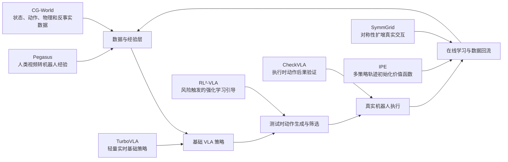
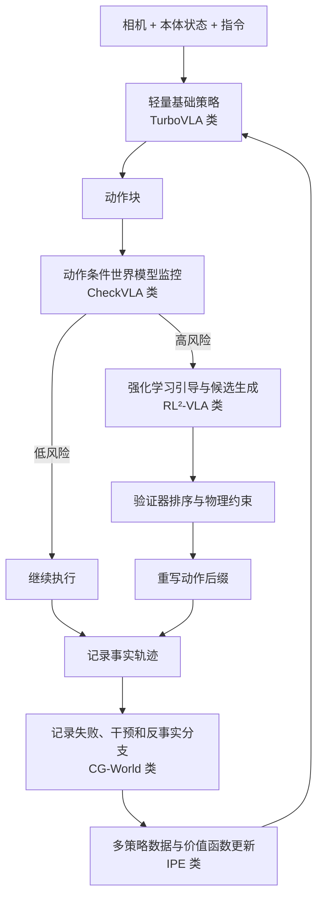

# VLA 实时控制、执行验证与在线学习

> 文档定位：2026-07-31 的阶段性前沿专题观察。
>
> 维护策略：后续出现新的独立研究问题时优先新建文档；只有当新工作与“实时控制—执行验证—测试时扩展—在线学习—数据回流”链路高度连续时，才继续扩写本文。

- 范围：TurboVLA、CheckVLA、RL²-VLA、Do You Really Need to Pretrain Q-Functions for Online RL Fine-Tuning?、Pegasus、CG-World、SymmGrid
- 证据边界：这些工作均为近期预印本，实验数字主要来自作者报告，不能替代独立复现或同行评审。
- 资源核验日期：2026-07-31
- 上级索引：[专题文档索引](../README.md)
- 研究地图：[具身智能研究地图](../../../RESEARCH_MAP.md)

---

## 目录

- [一、执行摘要](#一执行摘要)
- [二、七篇工作的整体关系](#二七篇工作的整体关系)
- [三、逐篇分析](#三逐篇分析)
  - [3.1 TurboVLA](#31-turbovla)
  - [3.2 CheckVLA](#32-checkvla)
  - [3.3 RL²-VLA](#33-rlvla)
  - [3.4 在线强化学习微调是否需要预训练价值函数](#34-在线强化学习微调是否需要预训练价值函数)
  - [3.5 Pegasus](#35-pegasus)
  - [3.6 CG-World](#36-cg-world)
  - [3.7 SymmGrid](#37-symmgrid)
- [四、横向比较](#四横向比较)
- [五、对我的研究最值得参考的内容](#五对我的研究最值得参考的内容)
- [六、可以直接转化为实验的研究问题](#六可以直接转化为实验的研究问题)
- [七、整体趋势与综合判断](#七整体趋势与综合判断)
- [八、推荐阅读顺序](#八推荐阅读顺序)
- [九、参考文献](#九参考文献)

---

# 一、执行摘要

这七篇工作不是在同一个排行榜上竞争，而是在解决视觉—语言—动作模型（Vision-Language-Action Model，VLA）与机器人学习系统的不同瓶颈：

| 工作 | 主要解决的问题 | 最具特色的贡献 |
|---|---|---|
| TurboVLA | VLA 推理延迟和显存占用过高 | 用约 0.2B 参数的轻量架构，在 RTX 4090 上实现约 32 Hz、推理显存低于 1 GB |
| CheckVLA | 动作块执行期间缺乏闭环反馈 | 用动作条件世界模型预测动作后果，在执行过程中检测偏差并重写动作后缀 |
| RL²-VLA | 测试时增加采样可能既救失败、又破坏原本正确的动作 | 只在高失败风险状态触发强化学习引导和候选筛选 |
| Q-function / IPE | 在线强化学习微调前是否需要预训练价值函数 | 指出朴素价值函数预训练存在策略目标错配，提出多策略轨迹初始化 |
| Pegasus | 人类视频难以直接转化为机器人训练数据 | 用任务图、可供性、机器人约束和物理验证，将人类视频转化为可执行机器人经验 |
| CG-World | 世界模型数据通常缺少显式状态、物理机制和反事实分支 | 建立带状态、动作、接触、物理参数、观测和反事实分支的大规模数据协议 |
| SymmGrid | 实机在线强化学习的物理采样过于昂贵 | 利用任务对称性，把一条真实轨迹扩增为大量等价训练样本 |

对我的研究而言，最值得关注的不是单篇论文的分数，而是它们共同呈现出的一条系统路线：

> **轻量基础策略负责常态控制，世界模型或验证器负责执行监控，高风险状态才调用昂贵的测试时搜索或强化学习，所有干预和失败都结构化记录并回流到数据与在线学习中。**

这比“继续把单体 VLA 做得更大”更接近真实机器人系统。

---

# 二、七篇工作的整体关系

可以把七篇论文放在同一条机器人学习闭环中理解：

它们分别对应以下系统角色：

1. **TurboVLA：便宜、快速的基础控制策略。**
2. **CheckVLA：常开的执行监控器。**
3. **RL²-VLA：仅在风险状态触发的昂贵候选生成器。**
4. **价值函数与 IPE：把在线数据转化为可用于强化学习的动作价值估计。**
5. **Pegasus：扩充可学习经验的来源。**
6. **CG-World：规范数据结构，使世界模型、验证器和反事实学习有高质量监督。**
7. **SymmGrid：提高每条真实机器人交互数据的复用率。**

---

# 三、逐篇分析

## 3.1 TurboVLA

### 3.1.1 核心问题

许多视觉—语言—动作模型沿用“大型视觉语言模型 + 动作头”的结构。即使机器人只需要理解简短执行指令，系统仍保留数十亿参数的大型语言模型，造成：

- 推理延迟高；
- 显存占用大；
- 很难运行在机器人端侧；
- 大模型语义推理能力与低层动作控制需求并不完全匹配。

TurboVLA 的核心问题是：

> 对于执行级机器人控制，是否真的需要让大型自回归语言模型处于实时控制闭环中？

### 3.1.2 技术路线

TurboVLA 使用面向控制的轻量架构：

- DINOv3 视觉编码器；
- 轻量 BERT 文本编码器；
- 双向视觉—语言特征交互模块；
- 动作分块变换器（Action Chunking Transformer，ACT）式解码器；
- 一次性输出连续动作块，不进行自回归动作词元生成。

模型总体参数量约为 0.2B。

其基本映射可写为：

$$
\mathbf{o}_{t},\ \mathbf{l}
\;\xrightarrow{\text{视觉与语言编码}}\;
\mathbf{z}_{t}
\;\xrightarrow{\text{跨模态交互}}\;
\hat{\mathbf{a}}_{t:t+H-1},
$$

其中：

- $\mathbf{o}_{t}$ 表示当前视觉观测；
- $\mathbf{l}$ 表示语言指令；
- $\mathbf{z}_{t}$ 表示融合后的特征；
- $\hat{\mathbf{a}}_{t:t+H-1}$ 表示预测的长度为 $H$ 的动作块。

训练使用行为克隆，主要优化连续动作的 $L_1$ 损失：

$$
\mathcal{L}_{\mathrm{BC}}
=
\frac{1}{H}
\sum_{i=0}^{H-1}
\left\|
\hat{\mathbf{a}}_{t+i}
-
\mathbf{a}_{t+i}
\right\|_1.
$$

### 3.1.3 特色贡献

最有特色的贡献不是某个复杂新模块，而是对 VLA 架构假设的重新审视：

> **执行级语言理解不一定需要大型语言模型参与每次控制推理。**

这意味着 VLA 可以分层：

- 大模型负责高层任务理解、规划或指令改写；
- 小模型负责高频、连续、实时的低层动作输出。

这与机器人系统的工程现实更加一致。

### 3.1.4 主要结果

论文报告：

- RTX 4090 上约 31.2 ms 推理延迟；
- 推理显存约 0.9 GB；
- 对应约 32 Hz 的模型前向能力；
- LIBERO 平均成功率约 97.7%；
- 在 RoboTwin 2.0 和实机任务上也保持较强表现。

需要注意：

> 31.2 ms 的模型前向时间不自动等价于完整机器人系统能以 32 Hz 完成“图像采集—预处理—推理—通信—动作下发—新观测”的闭环。

### 3.1.5 局限

- 主要面向具体的执行级语言指令；
- 对复杂语义推理、长程规划和多轮交互能力验证不足；
- 使用动作块后，块内部仍可能缺少及时反馈；
- RTX 4090 上的结果不能直接推断到 Jetson 或低功耗端侧硬件；
- 高成功率任务与长时序、开放环境任务不可直接比较。

### 3.1.6 对我的参考价值

1. **建立轻量 VLA 延迟基线。**  
   在研究复杂世界模型、强化学习后训练之前，应先判断性能瓶颈是否真的来自“模型能力不足”，还是来自不必要的大模型架构。

2. **区分三个频率：**
   - 低层控制命令频率；
   - VLA 策略调用频率；
   - 有效视觉闭环频率。

3. **动作块长度应被当成关键实验变量。**  
   动作块越长，推理成本越低，但闭环反馈越弱；动作块越短，鲁棒性可能提高，但模型调用成本增加。

4. **适合作为分层系统的底层执行器。**

---

## 3.2 CheckVLA

### 3.2.1 核心问题

动作块策略一次产生多个连续动作后，机器人通常会执行一段时间才重新调用高层模型。在这段期间：

- 物体可能滑动；
- 抓取可能失败；
- 底盘可能偏移；
- 接触状态可能与预期不同；
- 动作块剩余部分可能已经不再适用。

仅根据策略输出时的置信度，无法判断执行后的真实世界是否发生了偏差。

CheckVLA 的核心思想是：

> 不只判断“动作是否看起来合理”，而是判断“真实执行结果是否符合该动作本来应该造成的后果”。

### 3.2.2 技术路线

CheckVLA 冻结基础 VLA，并训练一个动作条件世界模型。世界模型接收：

- 当前观测；
- 已执行动作；
- 尚未执行的动作后缀；
- 历史关键帧或任务进度信息。

它预测未来短期视觉特征：

$$
\hat{\mathbf{z}}_{t+\Delta}
=
f_{\theta}
\left(
\mathbf{z}_{t},
\mathbf{a}_{t:t+\Delta-1}
\right).
$$

真实观测经过编码得到 $\mathbf{z}_{t+\Delta}$，随后计算风险分数：

$$
r_t
=
g_{\phi}
\left(
\hat{\mathbf{z}}_{t+\Delta},
\mathbf{z}_{t+\Delta}
\right).
$$

当 $r_t$ 超过校准阈值 $\tau$ 时，系统触发动作修复：

$$
r_t > \tau
\quad\Rightarrow\quad
\text{rewrite action suffix}.
$$

修复时，已经无法撤回的动作构成“硬前缀”，系统只重写仍可替换的动作后缀：

$$
\mathbf{a}_{t:t+H-1}
=
\underbrace{\mathbf{a}_{t:t+k-1}}_{\text{不可撤销前缀}}
\oplus
\underbrace{\tilde{\mathbf{a}}_{t+k:t+H-1}}_{\text{重新生成后缀}}.
$$

### 3.2.3 特色贡献

CheckVLA 最有价值的贡献是把 VLA 可靠性从：

- 动作生成前的策略不确定性；
- 图像级异常检测；

推进到：

- **动作—后果一致性验证**；
- **执行时闭环监控**；
- **考虑系统延迟的动作后缀修复**；
- **保留任务进度的关键帧记忆**。

这更接近工业控制中的运行时保障（runtime assurance）。

### 3.2.4 主要结果

论文在 RoboCasa365 长时序移动操作任务中报告：

- 周期性重规划成功率约 27.6%；
- 完整 CheckVLA 约 36.1%；
- 在策略调用次数接近的情况下，收益主要来自更合理的触发时机和修复方式；
- 在 5% 轨迹级误报警目标下，及时故障召回约 77.9%。

尤其关键的是：

- 仅看观测的异常检测明显弱于动作条件验证；
- 打乱动作后，验证性能显著下降。

这说明模型确实利用了“动作与后果”的条件关系，而不只是检测图像是否异常。

### 3.2.5 局限

- 实验主要在仿真中完成；
- 世界模型在遮挡、接触和多解状态下可能出现歧义；
- 统计校准依赖校准集与测试集的可交换性；
- 阈值保证不是完整的机器人安全证明；
- 对真实传感器延迟、相机掉帧、定位漂移和人类干预的验证不足；
- 监控器本身也可能漏报或报警过晚。

### 3.2.6 对我的参考价值

这是七篇中与我当前“数据质量评估—世界模型—执行验证”主线连接最直接的一篇。

值得迁移的思想包括：

1. **将数据质量从静态数据属性扩展到动作后果可验证性。**  
   一条轨迹是否高质量，不只看动作是否平滑，还可以看：

   $$
   \text{观测变化}
   \overset{?}{\approx}
   \text{给定动作下世界模型预测的变化}.
   $$

2. **把世界模型误差分解为可解释维度：**
   - 目标物体状态偏差；
   - 末端执行器状态偏差；
   - 接触事件偏差；
   - 任务进度偏差；
   - 动作时序偏差。

3. **数据评估与运行时验证可以共用模型和信号。**
   - 离线：评估数据中的动作—状态一致性；
   - 在线：监控策略执行是否偏离预期。

4. **可以形成数据闭环。**  
   被监控器判为高风险的片段，可成为后续重点采集、标注、重放和强化学习的数据。

---

## 3.3 RL²-VLA

### 3.3.1 核心问题

测试时扩展通常通过以下方式增加计算：

- 重复采样多个动作；
- 改写语言指令；
- 增加候选轨迹；
- 使用验证器选出最优动作。

但候选多样性不是总有益：

- 对原本会失败的状态，多样性可能找到更好动作；
- 对原本会成功的状态，多样性可能把动作推离正确模式。

因此，RL²-VLA 关注：

> 测试时额外计算应该在什么状态下被触发？

### 3.3.2 技术路线

对于基于流匹配（Flow Matching）的 VLA，模型在生成动作的过程中存在流速度场。RL²-VLA 提取动作专家的潜在表示 $\mathbf{e}_t$，并训练强化学习策略输出引导速度：

$$
\mathbf{v}_{\mathrm{RL}}
=
\pi_{\mathrm{RL}}
\left(
\mathbf{e}_t
\right).
$$

基础 VLA 的速度为 $\mathbf{v}_{\mathrm{VLA}}$，组合后的速度可概念化为：

$$
\mathbf{v}_{\mathrm{mix}}
=
\mathbf{v}_{\mathrm{VLA}}
+
\lambda_t
\mathbf{v}_{\mathrm{RL}},
$$

其中 $\lambda_t$ 由失败风险决定。低风险状态下：

$$
\lambda_t \approx 0,
$$

高风险状态下：

$$
\lambda_t > 0.
$$

系统还包括：

- 失败检测器；
- 多候选动作生成；
- 外部验证器或排序器；
- 自适应触发机制。

### 3.3.3 特色贡献

RL²-VLA 的特色不是简单地“用强化学习改进 VLA”，而是：

> **只在原策略可能失败的状态中分配额外计算和动作多样性。**

这是一种条件化测试时扩展：

$$
\text{compute budget}
=
f\left(
\text{failure risk}
\right).
$$

它避免把昂贵采样无差别地应用于所有状态。

### 3.3.4 主要结果

论文报告：

- 在多个分布外仿真任务中，相对重复采样、语言改写等基线有明显增益；
- 在实机分布外任务中，自适应触发优于始终开启引导；
- 潜在表示上的强化学习明显优于直接从原始观测训练强化学习策略；
- 引导模块本身的延迟较低，但总成本仍由多次 VLA 前向与验证器调用主导。

### 3.3.5 局限

- 失败检测器需要真实任务上的校准；
- 仿真训练的风险检测器不能直接保证实机有效；
- 方法依赖外部验证器能正确排序候选；
- 离线数据如果没有覆盖目标失败模式，引导策略可能只产生“不同但无用”的动作；
- 测试时多候选生成仍可能很昂贵；
- 不同基础 VLA 架构的引导方式并不统一。

### 3.3.6 对我的参考价值

1. **强化学习不一定直接修改整个 VLA。**  
   可以只训练一个轻量残差策略、潜在引导器或动作修正器。

2. **强化学习的作用位置可以在动作生成内部。**  
   这比把奖励简单加到最终动作头更细致。

3. **测试时计算应该按风险分配。**  
   这与数据质量评估可以形成接口：

   $$
   \text{高风险 / 低质量状态}
   \Rightarrow
   \text{更多候选、更多验证或更强策略}.
   $$

4. **需要分别统计：**
   - 对原本失败状态的挽救率；
   - 对原本成功状态的破坏率。

仅报告总体成功率会掩盖测试时扩展的副作用。

5. **可与 CheckVLA 组合。**
   - CheckVLA 负责判断真实后果是否偏离；
   - RL²-VLA 负责在偏离或高风险时生成更好的替代动作。

---

## 3.4 在线强化学习微调是否需要预训练价值函数

论文题目：**Do You Really Need to Pretrain Q-Functions for Online RL Fine-Tuning?**

### 3.4.1 核心问题

常见直觉是：

1. 先用示范数据训练行为克隆策略；
2. 再用离线数据预训练动作价值函数；
3. 最后进入在线强化学习。

论文发现，朴素预训练动作价值函数并不稳定优于随机初始化。

### 3.4.2 核心解释：策略目标错配

离线阶段学到的主要是基础策略的动作价值：

$$
Q^{\pi_{\mathrm{base}}}(s,a).
$$

但在线强化学习最终需要的是改进策略的动作价值：

$$
Q^{\pi_{\mathrm{RL}}^*}(s,a).
$$

两者并不相同：

$$
Q^{\pi_{\mathrm{base}}}
\neq
Q^{\pi_{\mathrm{RL}}^*}.
$$

如果离线数据主要来自单一行为策略，那么同一状态附近可观察到的动作变化很小，价值函数可能退化为近似状态价值函数：

$$
Q(s,a)
\approx
V(s),
$$

即它没有学会真正区分不同动作的长期后果。

### 3.4.3 IPE 方法

作者提出通过策略集合初始化（Initialization via Policy Ensemble，IPE）：

1. 训练多个行为不同的策略 $\{\pi_i\}_{i=1}^{N}$；
2. 每个策略采集部分轨迹；
3. 合并轨迹初始化经验回放池；
4. 再进行在线强化学习。

合并数据集为：

$$
\mathcal{D}_{\mathrm{IPE}}
=
\bigcup_{i=1}^{N}
\mathcal{D}_{\pi_i}.
$$

核心目的不是单纯增加轨迹总数，而是提高同一状态邻域中的动作覆盖：

$$
\mathrm{Coverage}
\left(
a \mid s
\right)
\uparrow.
$$

论文在固定总轨迹数时发现，增加策略数量通常优于单一策略采集更多重复轨迹。

### 3.4.4 特色贡献

这篇论文最重要的是一个负面结论：

> **价值函数是否有用，关键不只在于是否经过预训练，而在于数据中是否存在足够的动作差异，使价值函数能学会比较动作。**

对机器人强化学习而言，这比“再做更多离线时序差分更新”更重要。

### 3.4.5 局限

- 主实验采用较小规模模仿策略，不是真正的大型 VLA；
- 主要研究离策略强化学习；
- IPE 需要额外真实机器人轨迹；
- 多策略差异来自随机种子、数据子集、模型结构还是动作噪声，尚未完全拆分；
- 多策略采集可能增加安全风险。

### 3.4.6 对我的参考价值

这与我此前考虑“把 episode 级质量评分作为强化学习奖励”直接相关。

关键启示是：

1. **奖励函数存在，不代表价值函数就能学好。**  
   如果数据中缺少同状态下不同质量动作，价值函数很难学习动作偏好。

2. **数据质量评估需要关注动作覆盖。**  
   数据集级评估不能只看状态和场景多样性，还应看：

   $$
   \mathcal{C}_{a\mid s}
   =
   \mathbb{E}_{s}
   \left[
   \mathrm{Diversity}
   \left(
   p(a\mid s)
   \right)
   \right].
   $$

3. **可以构建多策略数据，而不一定要训练多个完整 VLA。**
   - 不同轻量适配器；
   - 不同训练随机种子；
   - 不同数据子集；
   - 不同动作温度；
   - 不同 checkpoint；
   - 不同奖励偏好。

4. **评估价值函数前，应先做动作覆盖消融。**

---

## 3.5 Pegasus

论文题目：**From Passive Video to Editable Experience: Physically Grounded Experience Synthesis for Embodied Intelligence**

### 3.5.1 核心问题

人类第一视角或第三视角视频中包含大量操作知识，但无法直接作为机器人动作示范，因为存在：

- 人手与机械臂形态差异；
- 视角差异；
- 工作空间差异；
- 运动学和关节限制；
- 接触与碰撞约束；
- 视频中通常缺乏机器人动作标签。

Pegasus 试图将“被动视频”转化为“可编辑、可执行、可用于训练的机器人经验”。

### 3.5.2 技术路线

Pegasus 不直接做像素级风格迁移，而是先把视频解析为结构化经验：

1. 任务图；
2. 可供性图；
3. 约束图；
4. 机器人规划图；
5. 物理可行性验证；
6. 失败后重新生成；
7. 输出机器人视频、动作词元或连续轨迹。

可以把流程写为：

$$
\text{Human Video}
\rightarrow
\mathcal{G}_{\mathrm{task}}
\rightarrow
\mathcal{G}_{\mathrm{affordance}}
\rightarrow
\mathcal{G}_{\mathrm{constraint}}
\rightarrow
\mathcal{G}_{\mathrm{robot}}
\rightarrow
\text{Validated Experience}.
$$

其中约束图包含：

- 抓取类型；
- 逆运动学可解性；
- 机器人工作空间；
- 关节限制；
- 碰撞条件；
- 轨迹平滑性。

### 3.5.3 特色贡献

最有价值的思想是：

> **跨形态迁移不应只在像素层解决，而应先在任务拓扑、可供性和物理约束层完成对齐。**

即使不采用其视频生成模块，这套结构仍可用于：

- 人类视频重标注；
- 跨机器人轨迹重定向；
- 合成数据质量过滤；
- 子任务分解；
- 课程学习数据构建。

### 3.5.4 主要结果

论文报告：

- 图条件生成优于仅用文本提示的生成；
- 物理验证显著降低碰撞和关节越界；
- 加入生成示范可提高下游 OpenVLA 和 ACT 的任务成功率；
- 生成数据单独训练也能达到一定可用性能；
- 可供性表示比仅使用物体身份更利于未见物体泛化。

### 3.5.5 局限

- 任务分解错误会沿流水线传播；
- 物理验证主要覆盖运动学，不能完全覆盖接触动力学；
- 对插接、倾倒、柔性物体和摩擦敏感任务，逆运动学与碰撞检查不足；
- 生成视频的视觉合理性不等于动作可学习性；
- 系统实现、计算成本和完整训练配方披露有限；
- 仍需独立复现验证。

### 3.5.6 对我的参考价值

Pegasus 对数据质量评估的启发非常大。

它提示数据质量可以分为：

1. **任务语义正确性**
2. **子任务顺序正确性**
3. **目标物体和可供性正确性**
4. **运动学可行性**
5. **碰撞与关节约束**
6. **轨迹平滑性**
7. **状态变化一致性**
8. **下游可学习性**

可以定义一个分层质量函数：

$$
Q_{\mathrm{episode}}
=
w_1 Q_{\mathrm{semantic}}
+
w_2 Q_{\mathrm{affordance}}
+
w_3 Q_{\mathrm{kinematic}}
+
w_4 Q_{\mathrm{dynamic}}
+
w_5 Q_{\mathrm{learnability}}.
$$

但要注意，最终最可信的指标仍是：

$$
Q_{\mathrm{learnability}}
=
\Delta
\text{Downstream Policy Performance}.
$$

也就是说，代理指标必须通过真实下游策略训练验证。

---

## 3.6 CG-World

### 3.6.1 核心问题

常规视频数据通常只有像素；机器人数据常只有观测和动作；仿真数据虽然有状态，但受特定引擎和任务限制。

世界模型真正需要联合学习：

- 世界状态；
- 动作；
- 接触和事件；
- 物理参数；
- 观测函数；
- 干预变量；
- 反事实结果。

CG-World 从工业计算机图形制作流程中恢复这些中间状态，并建立统一数据协议。

### 3.6.2 数据表示

CG-World 区分“世界状态”和“观测”：

$$
\mathbf{o}_t
=
h
\left(
\mathbf{s}_t,
\mathbf{c}_t
\right),
$$

其中：

- $\mathbf{s}_t$ 为显式世界状态；
- $\mathbf{c}_t$ 为相机、光照和渲染条件；
- $\mathbf{o}_t$ 为 RGB、深度、法线、分割、光流等观测。

世界状态转移写为：

$$
\mathbf{s}_{t+1}
=
F
\left(
\mathbf{s}_t,
\mathbf{a}_t,
\mathbf{m},
\boldsymbol{\xi}_t
\right),
$$

其中：

- $\mathbf{a}_t$ 为动作或干预；
- $\mathbf{m}$ 为物理机制与参数；
- $\boldsymbol{\xi}_t$ 为随机扰动。

反事实分支可以表示为：

$$
\mathbf{s}_{t+1}^{(k)}
=
F
\left(
\mathbf{s}_t,
\mathbf{a}_t^{(k)},
\mathbf{m}^{(k)},
\boldsymbol{\xi}_t
\right).
$$

同一初始状态下，可以改变：

- 动作；
- 观察条件；
- 摩擦、质量、黏度等机制参数；
- 接触条件；
- 释放时机。

### 3.6.3 特色贡献

CG-World 最有特色的是“分支谱系”设计：

> 同一事实轨迹、观测干预、动作反事实和机制反事实之间具有明确的继承关系。

这为以下任务提供了非常强的监督：

- 世界模型训练；
- 动作后果预测；
- 故障诊断；
- 因果表征；
- 验证器训练；
- 反事实规划；
- 数据质量评估。

### 3.6.4 主要结果

论文报告数据规模约为 85 万个短视频片段，并在以下任务上验证：

- 条件视频生成；
- 未来动作预测；
- OpenVLA 跨任务迁移；
- 未见任务泛化；
- 几何和物理条件控制。

尤其值得关注的是，收益主要不只来自抓取本身，而来自抓取后的抬升、运输和连续动作过程。

### 3.6.5 局限

- 工业计算机图形数据可能带有艺术制作偏差；
- 渲染引擎和物理求解器与现实存在差异；
- 透明、合成和程序化材质可能破坏状态—观测严格对应；
- 数据和训练成本披露不足；
- 完整数据的公开与许可状态需要进一步确认；
- 反事实物理参数未必具有真实世界可校准性。

### 3.6.6 对我的参考价值

CG-World 对我当前的数据集级质量评估特别重要。

#### 第一，数据划分必须考虑谱系泄漏

同一场景资产、同一初始状态、同一轨迹分支不能跨训练集和测试集，否则模型可能通过外观或近重复内容记忆答案。

可定义一个轨迹谱系标识：

$$
\mathrm{LineageID}
=
\mathrm{Hash}
\left(
\text{scene},
\text{initial state},
\text{asset version},
\text{branch root}
\right).
$$

数据划分应满足：

$$
\mathrm{LineageID}_{\mathrm{train}}
\cap
\mathrm{LineageID}_{\mathrm{test}}
=
\varnothing.
$$

#### 第二，数据质量不能只统计场景、物体和动作多样性

还应评估是否覆盖：

- 关键干预；
- 失败分支；
- 恢复路径；
- 机制变化；
- 接触事件；
- 动作反事实。

#### 第三，世界模型评估应区分

- 观测预测；
- 状态预测；
- 动作后果预测；
- 机制参数识别；
- 反事实一致性。

#### 第四，适合训练 CheckVLA 类验证器

CG-World 式数据天然提供“同状态、不同动作、不同后果”，这正是动作条件验证器和价值函数所缺少的数据。

---

## 3.7 SymmGrid

### 3.7.1 核心问题

实机强化学习最昂贵的部分通常不是反向传播，而是机器人真实交互。

如果任务在某些空间变换下保持动力学和奖励不变，那么一条真实交互可以产生多个等价训练样本。

### 3.7.2 技术路线

设机器人转移为：

$$
\tau_t
=
\left(
s_t,
a_t,
r_t,
s_{t+1}
\right).
$$

若变换 $g$ 保持任务动力学和奖励，则：

$$
g(\tau_t)
=
\left(
g_s(s_t),
g_a(a_t),
r_t,
g_s(s_{t+1})
\right)
$$

也应是有效训练样本。

论文主要使用机器人基坐标系中的平移对称性。在二维网格上：

$$
g_{\Delta x,\Delta y}
:
(x,y)
\mapsto
(x+\Delta x,y+\Delta y).
$$

一个 $27\times27$ 的网格理论上可为每条转移产生：

$$
27^2 = 729
$$

个位置等价样本。

对腕部相机，机器人和任务共同平移后图像可近似保持不变；对外部相机，则通过单应变换进行图像重映射。

### 3.7.3 特色贡献

SymmGrid 的核心思想是：

> **通过显式利用任务对称性，提高每一条真实机器人数据的训练价值。**

它不是简单随机数据增强，而是基于动力学与奖励不变性的等价变换。

### 3.7.4 主要结果

论文在 Franka FR3 的插孔、走线和物体搬运任务上报告：

- 训练收敛时间明显缩短；
- 成功率提升；
- 部分任务可在十几分钟内达到很高成功率；
- 最大对称网格并不总是最好；
- 中等规模的对称分支在复杂任务中更稳定。

### 3.7.5 局限

- 对称性必须真实保持任务动力学和奖励；
- 单应变换不能处理复杂视差、遮挡和显露区域；
- 大网格会产生边界和插值伪影；
- 增强样本高度相关，可能过快替换经验回放池中的真实数据；
- 只验证了有限平移对称和固定任务；
- 尚未充分验证语言条件、多物体语义和动态障碍。

### 3.7.6 对我的参考价值

这篇论文对“数据质量”和“数据价值”提供了一个重要区分：

> 数据质量高，不等于数据边际价值高；一条高质量但高度重复的数据，可能不如一条能通过合法对称性产生多个等价样本的数据。

可以定义单条真实轨迹的有效数据价值：

$$
V_{\mathrm{data}}(\tau)
=
Q(\tau)
\times
N_{\mathrm{valid\ transforms}}(\tau)
\times
U(\tau),
$$

其中：

- $Q(\tau)$：轨迹本身质量；
- $N_{\mathrm{valid\ transforms}}$：合法变换数量；
- $U(\tau)$：相对于当前数据集的新颖性或边际效用。

对 VLA 数据增强，需要同时变换：

- 图像；
- 本体状态；
- 动作；
- 目标位置；
- 语言描述；
- 奖励或任务成功条件。

必须满足等变闭环：

$$
\pi
\left(
g_o(o),
g_l(l)
\right)
\approx
g_a
\left(
\pi(o,l)
\right).
$$

---

# 四、横向比较

## 4.1 核心维度对比

| 工作 | 所处阶段 | 是否修改基础策略 | 是否需要世界模型 | 是否使用强化学习 | 主要收益 | 主要风险 |
|---|---|---:|---:|---:|---|---|
| TurboVLA | 基础策略 | 是 | 否 | 否 | 低延迟、低显存 | 复杂语义与长程规划能力不足 |
| CheckVLA | 执行监控 | 否，主要增加监控层 | 是 | 否 | 及时检测和修复动作偏差 | 世界模型误差和校准漂移 |
| RL²-VLA | 测试时扩展 | 轻量引导或组合 | 可选 | 是 | 高风险状态下提高成功率 | 候选生成和验证成本 |
| Q-function / IPE | 在线学习 | 修改强化学习模块 | 否 | 是 | 改善价值函数动作区分能力 | 多策略实机采集成本 |
| Pegasus | 数据合成 | 否 | 部分使用生成模型 | 否 | 从人类视频产生机器人经验 | 物理真实性与误差传播 |
| CG-World | 数据基础设施 | 否 | 面向世界模型 | 否 | 显式状态、机制和反事实监督 | 计算机图形到现实差距 |
| SymmGrid | 在线学习数据增强 | 否 | 否 | 是 | 提高真实交互复用率 | 对称假设和视觉伪影 |

## 4.2 它们解决的是不同类型的“效率”

| 工作 | 主要提高的效率 |
|---|---|
| TurboVLA | 推理效率 |
| CheckVLA | 执行纠错效率 |
| RL²-VLA | 测试时计算分配效率 |
| IPE | 在线强化学习初始化效率 |
| Pegasus | 数据获取效率 |
| CG-World | 世界模型监督信息密度 |
| SymmGrid | 实机样本复用效率 |

因此，不应把这些论文的“样本效率”或“成功率”直接放在同一排行榜中比较。

---

# 五、对我的研究最值得参考的内容

结合我的当前方向——实机数据质量评估、世界模型、VLA 后训练和强化学习——七篇工作可转化为四条主线。

## 5.1 将数据质量评估从“静态评分”扩展到“可验证后果”

目前 episode 级评估常关注：

- 动作平滑性；
- 速度和加速度；
- 轨迹长度；
- 多模态同步；
- 成功或失败标签。

CheckVLA 和 CG-World 提示，还应增加：

### 动作—后果一致性

$$
Q_{\mathrm{consequence}}
=
-\frac{1}{T}
\sum_{t=1}^{T}
d
\left(
f_{\theta}(o_t,a_t),
o_{t+1}
\right).
$$

### 反事实可区分性

对于同一状态 $s$ 的不同动作 $a_i$，模型预测的后果应有合理差异：

$$
Q_{\mathrm{counterfactual}}
=
\mathbb{E}_{s}
\left[
\mathrm{Var}_{a}
\left(
f_{\theta}(s,a)
\right)
\right].
$$

### 失败与恢复覆盖

数据集是否包含：

- 正常轨迹；
- 可恢复失败；
- 不可恢复失败；
- 干预后恢复；
- 替代动作分支。

这比只统计成功轨迹数量更接近真实机器人学习需求。

---

## 5.2 把 episode 级质量分数转化为强化学习信号时，先解决信用分配

如果总奖励仅在 episode 末尾给出：

$$
R(\tau)
=
Q_{\mathrm{episode}}(\tau),
$$

那么长时序任务中的信用分配会很困难。

更合理的方式是把质量评估分解为时序局部信号：

$$
r_t
=
\alpha r_t^{\mathrm{task}}
+
\beta r_t^{\mathrm{smooth}}
+
\gamma r_t^{\mathrm{consistency}}
+
\delta r_t^{\mathrm{progress}}
-
\eta r_t^{\mathrm{risk}}.
$$

其中：

- $r_t^{\mathrm{task}}$：任务成功与阶段性进度；
- $r_t^{\mathrm{smooth}}$：动作平滑性；
- $r_t^{\mathrm{consistency}}$：动作后果一致性；
- $r_t^{\mathrm{progress}}$：子任务进度；
- $r_t^{\mathrm{risk}}$：碰撞、越界和不可恢复风险。

但需要警惕奖励投机。任何代理奖励都应通过以下对照验证：

1. 代理奖励提高；
2. 真实任务成功率是否提高；
3. 是否出现动作僵化、过度保守或停滞；
4. 是否破坏策略多样性；
5. 是否只在训练分布中有效。

---

## 5.3 数据集级质量评估应增加“同状态动作覆盖”

IPE 的结论说明，仅有高质量示范并不足以训练可靠价值函数。

建议加入条件动作覆盖指标：

$$
\mathcal{C}_{a\mid s}
=
\frac{1}{|\mathcal{S}|}
\sum_{s\in\mathcal{S}}
\mathrm{Entropy}
\left(
p(a\mid s)
\right).
$$

对于连续动作，可采用：

- 局部协方差；
- k 近邻动作体积；
- 条件熵估计；
- 聚类数量；
- 多策略动作分歧；
- 价值排序可辨识度。

还可以构建：

$$
\mathrm{PreferenceAccuracy}
=
\Pr
\left[
Q(s,a^+)
>
Q(s,a^-)
\right],
$$

其中 $a^+$ 和 $a^-$ 来自同一状态附近、质量不同的动作。

---

## 5.4 建立分层机器人学习系统，而不是单一端到端模型

最值得落地的系统组合是：

核心原则是：

- 基础策略要便宜；
- 监控器要常开但轻量；
- 昂贵计算要稀疏触发；
- 所有干预都要形成可追踪数据；
- 强化学习只在有足够动作覆盖和安全约束时启用。

---

# 六、可以直接转化为实验的研究问题

## 6.1 数据质量评估实验

### 问题一：动作后果一致性是否能预测下游可学习性？

实验设计：

1. 为每条 episode 计算世界模型预测误差；
2. 按误差从低到高筛选数据；
3. 固定数据量微调同一 VLA；
4. 比较真实任务成功率。

关键对照：

- 随机筛选；
- 动作平滑性筛选；
- 成功标签筛选；
- 世界模型一致性筛选；
- 多指标联合筛选。

### 问题二：世界模型误差高的数据究竟是低质量还是高信息量？

可能存在两种情况：

- 误差高，因为数据损坏、动作错误或同步异常；
- 误差高，因为数据包含罕见但有价值的状态转移。

因此可引入“双轴评估”：

$$
\mathrm{DataValue}
=
f
\left(
\mathrm{Validity},
\mathrm{Novelty}
\right).
$$

高误差数据需要进一步区分：

| 有效性 | 新颖性 | 处理建议 |
|---|---|---|
| 低 | 低 | 删除 |
| 低 | 高 | 修复或人工复核 |
| 高 | 低 | 保留少量，防止重复 |
| 高 | 高 | 高优先级保留 |

---

## 6.2 强化学习实验

### 问题三：episode 评分作为奖励，应该放在轨迹末端还是分解到时序？

对比：

$$
r_t^{(1)}
=
\begin{cases}
Q(\tau), & t=T,\\
0, & t<T,
\end{cases}
$$

与：

$$
r_t^{(2)}
=
\Delta Q_t
+
\lambda r_t^{\mathrm{task}}.
$$

评估：

- 收敛速度；
- 奖励方差；
- 最终任务成功率；
- 轨迹平滑性；
- 策略是否停滞；
- 是否出现奖励投机。

### 问题四：直接预训练价值函数是否不如多策略轨迹初始化？

固定总轨迹数，比较：

- 单策略 + 价值函数预训练；
- 多策略 + 随机价值函数；
- 多策略 + 价值函数预训练；
- 单策略高温采样；
- 多策略低温采样。

策略数可以使用：

$$
N\in\{1,3,5\}.
$$

---

## 6.3 VLA 运行时验证实验

### 问题五：数据质量模型能否同时作为运行时风险模型？

训练一个统一评分器：

$$
q_t
=
f_{\theta}
\left(
o_t,
a_{t:t+H-1},
o_{t+1}
\right).
$$

离线用途：

- 轨迹评分；
- 异常片段定位；
- 数据筛选。

在线用途：

- 动作后果监控；
- 重规划触发；
- 候选排序；
- 强化学习数据优先级。

需要验证：

- 离线评分与在线故障召回的相关性；
- 跨任务校准能力；
- 分布漂移下误报警；
- 真实接触任务中的可靠性。

---

## 6.4 对称增强实验

### 问题六：哪些机器人任务具有可利用的等变结构？

候选变换：

- 平移；
- 左右镜像；
- 绕竖直轴旋转；
- 目标物体排列置换；
- 相机外参变化；
- 双臂角色交换。

但每个变换都必须同时验证：

$$
\begin{aligned}
o' &= g_o(o),\\
l' &= g_l(l),\\
a' &= g_a(a),\\
r' &= r,\\
s'_{t+1} &= g_s(s_{t+1}).
\end{aligned}
$$

如果只有图像看起来合理，而动作、语言和奖励没有同步变换，则不是合法的机器人数据增强。

---

# 七、整体趋势与综合判断

## 7.1 VLA 正从“单体大模型”转向“分层机器人系统”

TurboVLA 表明常态控制可以很轻；CheckVLA 和 RL²-VLA 表明：

- 执行监控；
- 失败诊断；
- 测试时搜索；
- 候选验证；

可以成为独立模块。

未来更可能出现：

- 高层规划模型；
- 中层技能选择器；
- 低层实时策略；
- 世界模型验证器；
- 安全控制器；
- 在线学习模块。

而不是一个模型承担所有功能。

## 7.2 验证器的重要性正在接近策略本身

机器人系统不只需要回答：

> 下一步做什么？

还需要回答：

- 这个动作会导致什么？
- 真实执行结果是否符合预期？
- 是否已经偏离任务？
- 当前失败是否可恢复？
- 替代动作是否更安全？
- 何时值得调用更昂贵的模型？

因此，世界模型、价值函数、风险检测器和物理验证器会成为核心组件。

## 7.3 “样本效率”需要重新定义

七篇工作分别把成本转移到不同位置：

- TurboVLA 降低推理成本；
- RL²-VLA 增加测试时计算；
- IPE 增加多策略轨迹；
- Pegasus 增加生成和验证成本；
- CG-World 增加数据生产成本；
- SymmGrid 增加增强计算以减少真实交互。

因此，机器人学习应同时报告：

$$
\mathrm{Cost}
=
\left[
N_{\mathrm{real}},
N_{\mathrm{demo}},
N_{\mathrm{synthetic}},
T_{\mathrm{GPU}},
T_{\mathrm{wall}},
N_{\mathrm{forward}},
E_{\mathrm{energy}}
\right].
$$

只报告成功率或真实轨迹数会遗漏大量成本。

## 7.4 分布漂移仍是共同弱点

- CheckVLA 的校准可能失效；
- RL²-VLA 的失败检测器需要实机重校准；
- Pegasus 的物理验证不一定覆盖复杂动力学；
- CG-World 存在计算机图形到现实的差距；
- SymmGrid 的对称性受相机和场景几何影响；
- 价值函数可能因策略变化快速失配。

把多个模块串联并不会自动消除分布漂移，反而可能形成误差级联。

## 7.5 安全不能被成功率替代

运行时验证、置信度和统计阈值都不能替代：

- 独立安全控制器；
- 速度和力矩限制；
- 工作空间限制；
- 碰撞检测；
- 紧急停止；
- 硬件故障处理；
- 人机协作安全规范。

这些论文提供的是学习系统的风险缓解机制，不是完整安全认证。

---

# 八、推荐阅读顺序

结合我的当前研究重点，推荐顺序如下。

## 第一优先级：CheckVLA

原因：

- 与世界模型、动作块、执行监控和数据质量评估直接相关；
- 可以把离线数据评分和在线风险验证连接起来；
- 对“动作—后果一致性”提供了清晰方法论。

重点精读：

- 动作条件世界模型输入输出；
- 风险分数如何构造；
- 校准方法；
- 及时召回与误报警指标；
- 动作后缀修复；
- 失败类型分析。

## 第二优先级：在线强化学习价值函数与 IPE

原因：

- 直接影响我未来把数据质量评分迁移到强化学习的方案；
- 揭示价值函数训练所需的动作覆盖问题；
- 可以指导数据集级质量评估增加“条件动作多样性”。

重点精读：

- 为什么 $Q^{\pi_{\mathrm{base}}}$ 与 $Q^{\pi_{\mathrm{RL}}^*}$ 错配；
- 多策略数据如何提高动作辨识；
- 固定总轨迹数下的消融；
- 是否能迁移到大型 VLA。

## 第三优先级：CG-World

原因：

- 对数据集级质量评估、世界模型数据协议和反事实覆盖价值很高；
- 可借鉴谱系感知的数据划分和失败分支设计。

重点精读：

- 状态、观测、动作、机制的字段定义；
- 分支谱系；
- 反事实数据；
- 数据划分；
- 下游世界模型与 VLA 实验。

## 第四优先级：RL²-VLA

原因：

- 对 VLA 强化学习后训练和测试时扩展有直接启发；
- 特别适合研究“何时调用强化学习”和“如何减少成功状态被破坏”。

## 第五优先级：SymmGrid

原因：

- 对实机强化学习样本效率有具体可落地思路；
- 可为数据增强与数据价值评估提供新维度。

## 第六优先级：TurboVLA

原因：

- 工程价值强；
- 可作为低延迟基础策略和模型压缩参考；
- 但与当前数据质量评估主线的直接联系稍弱。

## 第七优先级：Pegasus

原因：

- 思路很新，适合扩展合成数据质量评估；
- 但系统较复杂，物理真实性和复现条件仍需谨慎核验。

---

# 九、参考文献

1. **TurboVLA: Real-Time Vision-Language-Action Model at 32 Hz on an RTX 4090 with <1 GB VRAM**  
   arXiv:2607.27205  
   <https://arxiv.org/abs/2607.27205>

2. **CheckVLA: Execution-Time Verification with Action-Conditioned World Model for Long-Horizon Mobile Manipulation**  
   arXiv:2607.26789  
   <https://arxiv.org/abs/2607.26789>

3. **RL²-VLA: Adaptive RL Latent Compositional Steering with Test-Time Scaling for Vision-Language-Action Models**  
   arXiv:2607.26991  
   <https://arxiv.org/abs/2607.26991>

4. **Do You Really Need to Pretrain Q-Functions for Online RL Fine-Tuning?**  
   arXiv:2607.27203  
   <https://arxiv.org/abs/2607.27203>

5. **From Passive Video to Editable Experience: Physically Grounded Experience Synthesis for Embodied Intelligence**  
   arXiv:2607.26903  
   <https://arxiv.org/abs/2607.26903>

6. **CG-World: A Large-Scale World-State Dataset and Protocol for World Models**  
   arXiv:2607.26452  
   <https://arxiv.org/abs/2607.26452>

7. **SymmGrid: Super-Scaling On-Robot Learning with Parallelized Symmetries and Egocentric–Exocentric Visual Perception**  
   arXiv:2607.26985  
   <https://arxiv.org/abs/2607.26985>

---

## 一句话总结

这七篇工作的共同方向，不是继续把单体视觉—语言—动作模型无限做大，而是把机器人学习重构为一个由**轻量策略、世界模型验证器、风险触发的测试时搜索、结构化数据、反事实分支和在线强化学习**共同组成的闭环系统；对我的研究而言，最值得优先推进的是把“数据质量评估”升级为可同时服务于**离线筛选、动作后果验证、风险检测和强化学习信用分配**的统一信号体系。

---

---

# 附录 A：论文、项目主页与代码索引

> 核验日期：2026-07-31  
> “未确认”表示截至核验日期，未在论文页或作者公开渠道确认官方代码仓库；不代表未来不会发布。

| 工作 | 论文 | 项目主页 | 官方代码 | 当前状态 |
|---|---|---|---|---|
| TurboVLA | [arXiv:2607.27205](https://arxiv.org/abs/2607.27205) | [GitHub 项目页](https://github.com/H-EmbodVis/TurboVLA) | [H-EmbodVis/TurboVLA](https://github.com/H-EmbodVis/TurboVLA) | 训练与评估代码已公开 |
| CheckVLA | [arXiv:2607.26789](https://arxiv.org/abs/2607.26789) | 未确认 | 未确认 | 论文公开，未在论文页确认官方代码 |
| RL²-VLA | [arXiv:2607.26991](https://arxiv.org/abs/2607.26991) | 未确认 | 未确认 | 论文公开，未在论文页确认官方代码 |
| Do You Really Need to Pretrain Q-Functions for Online RL Fine-Tuning? | [arXiv:2607.27203](https://arxiv.org/abs/2607.27203) | 未确认 | 未确认 | 论文公开，未在论文页确认官方代码 |
| Pegasus | [arXiv:2607.26903](https://arxiv.org/abs/2607.26903) | 未确认 | 未确认 | 论文公开，未在论文页确认官方代码 |
| CG-World | [arXiv:2607.26452](https://arxiv.org/abs/2607.26452) | 未确认 | 未确认 | 论文公开，数据与代码发布状态待跟踪 |
| SymmGrid | [arXiv:2607.26985](https://arxiv.org/abs/2607.26985) | [项目主页](https://symmgrid-robot.github.io/) | 未确认 | 项目主页公开，未确认官方 GitHub 仓库 |

## 资源状态更新规则

后续更新本表时：

1. 先查看 arXiv 最新版本和 Comments；
2. 再查看作者项目主页；
3. 只有确认作者或项目官方关系后，才填写“官方代码”；
4. 区分代码、模型权重、数据集和演示页面；
5. 更新本文 `updated` 日期和根目录 `CHANGELOG.md`。

---

# 附录 B：本文的后续维护边界

适合继续补入本文的内容：

- 轻量实时 VLA；
- 动作块执行反馈；
- 动作条件世界模型验证；
- 风险触发的测试时扩展；
- 在线强化学习初始化；
- 数据回流和动作修复。

更适合新建独立专题的内容：

- 完整的数据质量评估体系；
- 世界模型数据协议；
- VLA 强化学习算法综述；
- 合成数据与跨形态迁移；
- 实机安全控制；
- 端侧部署基准。

## 更新记录

- 2026-07-31：建立专题初稿；
- 2026-07-31：迁入 `my-embodied-ai-kb`，增加 YAML 元数据、相对索引和经过核验的资源状态。
