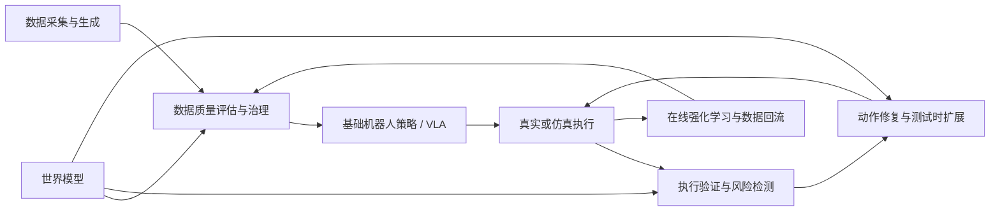
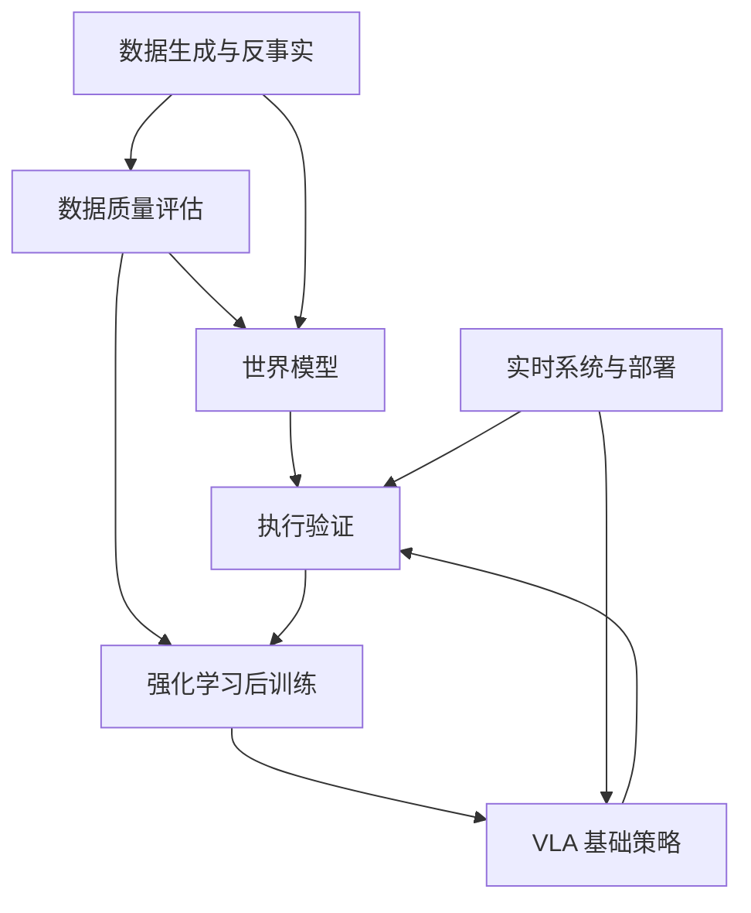

# 具身智能研究地图

> 这是当前认知的结构化快照，不是对具身智能领域的完整覆盖。
>
> 过去已经学习但尚未迁入的内容记录在 [`MIGRATION_BACKLOG.md`](../.kb/history/MIGRATION_BACKLOG.md)。

## 1. 总体闭环

长期目标不是让单一模型承担所有能力，而是理解并构建：

> 数据、策略、世界模型、执行验证、强化学习和系统安全之间的闭环。

## 2. 当前研究主线

### 2.1 实机机器人数据质量评估

核心问题：

- 如何定义单条轨迹质量？
- 如何定义数据集级质量？
- 哪些代理指标能预测下游策略提升？
- 数据有效性与数据新颖性如何区分？
- 如何识别同步错误、异常动作和不可学习轨迹？
- 如何评估同状态附近的动作覆盖？

当前优先级：**最高**

当前专题：

- [实机机器人数据质量评估总览](../kb/embodied-ai/robot-data/data-quality/实机机器人数据质量评估总览.md)

计划专题：

- 实机数据质量评估总览；
- episode 级质量评估；
- 数据集级覆盖与可学习性；
- 动作—后果一致性；
- 质量评估与下游策略性能的闭环验证。

### 2.2 视觉—语言—动作模型

核心问题：

- 视觉、语言和动作如何融合？
- 离散动作和连续动作各有什么限制？
- 动作块如何影响推理效率与闭环反馈？
- 大型语言模型是否必须进入高频控制回路？
- 长时序任务中如何保存阶段信息？
- 如何处理分布外场景和失败恢复？

当前专题：

- [VLA 实时控制、执行验证与在线学习](../kb/embodied-ai/vla/runtime-verification/2026-07-31_VLA实时控制执行验证与在线学习.md)

### 2.3 世界模型

核心问题：

- 世界状态与视觉观测如何区分？
- 如何进行动作条件未来预测？
- 像素预测误差能否评价机器人数据质量？
- 如何建模接触、事件和任务进度？
- 如何学习反事实动作后果？
- 世界模型能否作为运行时验证器？

与当前研究的主要连接：

1. 离线数据评分；
2. 动作—后果一致性；
3. 执行时风险检测；
4. 候选动作排序；
5. 强化学习中的稠密反馈。

代表工作（已迁移）：

- [世界模型与跨具身 VLA（种子）](../kb/embodied-ai/world-model/世界模型与跨具身_VLA_种子.md)：串接 LingBot-World/VA、DreamVLA、TriVLA、Foresight、X-VLA、Qwen-VLA、VLA_Aerial；结论强度已标注。
- [LingBot-World 深度分析](./03_papers/lingbot/analysis_LingBot_World.md)：推进开源世界模型（项目站，无 arXiv）。
- [LingBot-VA 深度分析](./03_papers/lingbot/analysis_LingBot_VA.md)：因果世界建模用于机器人控制（arXiv 待核验）。
- [DreamVLA 索引](./03_papers/dreamvla/INDEX.md)：综合世界知识预测（动态/空间/语义）+ 逆动力学闭环（2507.04447v3）。
- [TriVLA 索引](./03_papers/trivla/INDEX.md)：三系统架构 + 情景（episodic）世界模型（2507.01424v3）。
- [Foresight 笔记（A-D6）](./03_papers/d6_failure_detection/D6-Foresight-Failure-Detection-for-Long-Horizon-阅读笔记.md)：动作条件世界模型潜变量做长时程失败监测（2606.23085v1）。

### 2.4 强化学习与 VLA 后训练

核心问题：

- 行为克隆策略如何进一步提升？
- 质量评分能否转化为奖励？
- 长时序任务如何进行信用分配？
- 动作价值函数需要怎样的数据覆盖？
- 确定性动作头如何支持策略梯度方法？
- 离线到在线微调如何控制分布漂移？
- 实机强化学习如何保证安全和样本效率？

当前关注：

- 近端策略优化；
- 动作价值函数；
- 多策略数据；
- 轻量残差策略；
- 风险触发的测试时强化学习；
- 实机强化学习的合法数据增强。

代表工作（已迁移）：

- [RIPT-VLA 阅读笔记](./03_papers/ript_vla/RIPT-VLA_阅读笔记.md)：提出 VLA 训练「第三阶段」——强化学习交互式后训练；DS-LOOP（RLOO 留一法优势 + PPO 裁剪 + 动态采样），稀疏二元奖励 $\{0,1\}$，仅需初始状态 + 任务目标（无需动作标注）；核心洞察「RL 是 SFT 的补集」。配套 3 篇深入拆解（GRPO vs RLOO、PPO ε 调优、Rollout 存储与 On/Off-Policy）同目录。
- [VLA 后训练中的奖励与信用分配](../kb/embodied-ai/vla/post-training/VLA后训练中的奖励与信用分配.md)：横向比较 RIPT-VLA / VLA-RL / ConRFT / SimpleVLA-RL / GRPO-RLOO / 泛化实证六条路线，区分结论证据强度。
- [动作块与流匹配动作生成](../kb/embodied-ai/vla/foundations/动作块与流匹配动作生成.md)：ACT(VAE)→Diffusion Policy→π0(Flow) 动作生成范式演进；动作块理论保证（Zhang et al. 2025）；连接 VLA 后训练与实机部署成本。
- [AR-VLA 阅读笔记](./03_papers/ar_vla/AR-VLA_阅读笔记.md)：真自回归动作专家，KV cache 跨时间因果生成动作，替代伪自回归 chunk 头；RSS 2026。
- [X-VLA 阅读笔记](./03_papers/x_vla/X-VLA_阅读笔记.md)：Soft Prompt 跨具身 VLA，Flow Matching 动作生成，0.04% 参数吸收异构性；亦属跨具身研究线（§2.6）。

### 2.5 执行验证与可靠性

核心问题：

- 策略输出时的置信度能否反映执行后的偏差？
- 如何判断真实动作后果是否符合预期？
- 何时应该重规划？
- 如何避免频繁误报警？
- 如何在系统延迟下重写动作后缀？
- 运行时学习模块与独立安全控制器如何分工？

### 2.6 数据生成与跨形态迁移

核心问题：

- 人类视频如何转化为机器人可学习经验？
- 任务拓扑、可供性和物理约束如何对齐？
- 合成数据的视觉合理性是否等于可学习性？
- 如何验证合成轨迹的运动学、动力学和下游价值？
- 如何管理事实分支、干预分支和反事实分支？

代表工作（已迁移）：

- [X-VLA 阅读笔记](./03_papers/x_vla/X-VLA_阅读笔记.md)：Soft Prompt 跨具身 VLA，0.04% 参数吸收异构性（亦列于 §2.4）。
- [Qwen-VLA 深度分析](./03_papers/lingbot/analysis_Qwen_VLA.md)：跨任务 / 环境 / 实体统一 VLA 建模（2605.30280v1）。
- [LingBot-VLA 深度分析](./03_papers/lingbot/analysis_LingBot_VLA.md)：务实 VLA 基础模型，9 种双臂具身（2601.18692v2）。
- [VLA_Aerial 索引](./03_papers/vla_aerial/INDEX.md)：飞行具身 VLA（VLA-AN / π0-Aerial；arXiv 待核验）。

### 2.7 实时系统与部署

核心问题：

- 模型前向延迟与完整闭环延迟有何区别？
- 控制频率、策略频率和视觉反馈频率如何协调？
- 端侧显存和算力如何限制模型设计？
- 大模型规划与轻量策略执行如何分层？
- 通信、相机、控制器和机器人本体的延迟如何进入评估？

## 3. 当前专题关系

## 4. 当前重点开放问题

### 问题一：世界模型误差是低质量信号还是高信息量信号？

需要区分：

- 数据损坏；
- 多模态不同步；
- 不合理动作；
- 罕见但有效状态；
- 模型能力不足；
- 分布外状态。

### 问题二：episode 级质量能否转化为时序奖励？

单一末端分数可能带来严重信用分配困难。需要研究：

- 局部质量增量；
- 阶段进度；
- 动作后果一致性；
- 平滑性；
- 风险；
- 奖励投机。

### 问题三：同状态动作覆盖如何量化？

仅有大量成功示范，动作价值函数仍可能无法区分动作。需要建立：

- 条件动作熵；
- 局部动作协方差；
- 多策略分歧；
- 反事实动作对；
- 动作偏好可辨识度。

### 问题四：离线数据评分器能否复用为在线验证器？

理想统一接口：

$$
q_t=f_\theta(o_t,a_{t:t+H-1},o_{t+1})
$$

离线用于数据筛选，在线用于风险检测和动作修复。

### 问题五：动作块是否会产生“金鱼记忆”与阶段混淆？

需要分别研究：

- 长停顿状态；
- 相似观测对应不同任务阶段；
- 历史信息不足；
- 动作块无法跳出局部模式；
- 关键帧记忆；
- 部分可观测性。

## 5. 近期建议产出

1. `docs/02_topics/实机机器人数据质量评估总览.md`（已产出）
2. `docs/03_papers/Data_Quality_in_Imitation_Learning_阅读笔记.md`（已产出）
3. `docs/03_papers/Data_Assessment_for_Embodied_Intelligence_阅读笔记.md`（已产出）
4. `docs/03_papers/Robot_Data_Curation_with_Mutual_Information_Estimators_阅读笔记.md`（已产出）
5. `docs/02_topics/VLA后训练中的奖励与信用分配.md`（已产出，2026-07-31）
6. `docs/05_ideas/VLA动作块的停滞与阶段混淆问题.md`
7. `docs/03_papers/ript_vla/RIPT-VLA_阅读笔记.md`（已产出，2026-07-31；含 3 篇配套拆解）
8. `docs/02_topics/action_chunk_flow_matching/动作块与流匹配动作生成.md`（已产出，2026-08-03）
9. `docs/03_papers/ar_vla/AR-VLA_阅读笔记.md`（已产出，2026-08-03）
10. `docs/03_papers/x_vla/X-VLA_阅读笔记.md`（已产出，2026-08-03；跨具身）
11. `docs/03_papers/d6_failure_detection/INDEX.md`（已产出，2026-08-03；A-D6 失败检测 9 篇，PDF 仅索引）
12. `docs/02_topics/embodied_data_quality/实机机器人数据质量评估总览.md`（已补 A-D6 专节，2026-08-03）
13. `docs/03_papers/lingbot/INDEX.md`（已产出，2026-08-03；LingBot 系列 6 篇 + 汇总）
14. `docs/03_papers/{openvla,pi0,rt1,smolvla,trivla,ud_vla,vla_adapter,openvla_oft,pi05}/INDEX.md`（已产出，2026-08-03；9 个纯 PDF 模型索引，PDF 不进 git）
15. `docs/03_papers/{dreamvla,vla_aerial}/INDEX.md`（已产出，2026-08-03；世界模型 / 跨具身飞行平台索引）
16. `docs/02_topics/world_model/世界模型与跨具身_VLA_种子.md`（已产出，2026-08-03；世界模型 + 跨具身种子专题）

## 6. 维护规则

新增重要方向时：

1. 先判断是否需要独立专题；
2. 更新本地图中的问题节点；
3. 添加相对链接；
4. 标记当前证据强度；
5. 不将单篇论文的主张直接升级为领域共识；
6. 精确变更历史由 Git 保存；涉及用户认知结构的重要变化按 V2 `_map.md` / 认知演化规则处理。
